# APIs e Web Services

O projeto Saber+ consiste em uma aplicação Web que oferece uma plataforma de conexão entre professores e alunos para agendamento de aulas particulares, avaliação de serviços e gerenciamento de disponibilidade. A API fornece endpoints para o gerenciamento de usuários, professores, áreas de atuação, disponibilidade, agendamentos e avaliações, permitindo a integração de múltiplos sistemas clientes (web, mobile, etc.).

Acesse a API Saber+ pelo link: [https://github.com/Lais-lfs/apis-web-services-projeto-saber-mais](https://github.com/Lais-lfs/apis-web-services-projeto-saber-mais).

## Objetivos da API

A API do projeto Saber+ foi desenvolvida para fornecer uma interface robusta e segura que permita o gerenciamento eficiente de usuários, professores, áreas de conhecimento, disponibilidades, agendamentos e avaliações. Os principais objetivos desta API são:

- **Facilitar a integração** entre diferentes clientes (web, aplicativos móveis, etc.) e o backend da plataforma, garantindo comunicação consistente e eficiente.
- **Garantir a segurança** dos dados dos usuários incluindo informações pessoais e agendamentos.
- **Oferecer funcionalidades CRUD completas** para todos os recursos essenciais do sistema, como cadastro de usuários, professores, áreas de atuação, horários disponíveis, agendamentos e avaliações.
- **Suportar futuros aprimoramentos e integrações**, como autenticação, autorização, notificações e relatórios.

## Modelagem da Aplicação
A modelagem da aplicação Saber+ foi concebida para estruturar um sistema de agendamento de aulas e avaliações entre alunos e professores. A representação visual dessa estrutura foi consolidada através de um Diagrama de Classes, que detalha as entidades centrais do sistema, seus atributos, comportamentos e as relações entre elas. Este diagrama é fundamental para compreender a organização dos dados e a lógica de negócio que governa a plataforma.

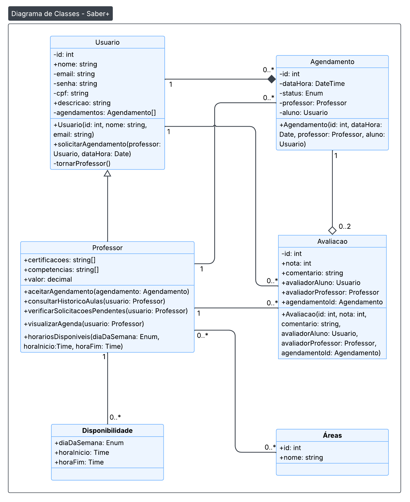

## Tecnologias Utilizadas

Para o desenvolvimento da API do Projeto Saber+, foram escolhidas tecnologias modernas e consolidadas que garantem desempenho, segurança e facilidade de manutenção. As principais tecnologias utilizadas são:

- **Entity Framework Core**: ORM (Object-Relational Mapper) utilizado para o mapeamento das entidades do sistema ao banco de dados, facilitando operações CRUD e consultas complexas.
- **SQL Server**: Sistema gerenciador de banco de dados relacional usado para armazenar os dados da aplicação de forma segura e estruturada.
- **ASP .NET Core Web API**: Framework para criação de APIs RESTful, com suporte nativo para rotas, controllers, validação, e segurança.
- **Swagger/OpenAPI**: Ferramenta para documentação automática da API, permitindo que desenvolvedores conheçam os endpoints disponíveis, parâmetros e respostas.
- **Insomnia**: Cliente REST utilizado para testar os endpoints da API durante o desenvolvimento, facilitando a simulação de requisições HTTP e análise de respostas.
- **Visual Studio**: IDE utilizado para o desenvolvimento,depuração (debug) e testes da aplicação.
- **Git e GitHub**: Para controle de versão e colaboração entre desenvolvedores. 

## API Endpoints

### Autenticar Usuário
- Método: POST
- URL: /api/Usuarios/Authenticate
- Parâmetros (body JSON):
  - `id`: ID do usuário que deseja se autenticar (int)  
  - `password`: senha feita em seu cadastro (string) 
- Resposta:
  - Sucesso (200 OK)
    ```json
    {
      "jwtToken": "string" // Token JWT gerado
    }
    ```
  - Erro (401 Unauthorized)
    ```json
    {
      "message": "ID ou senha inválidos"
    }
    ```
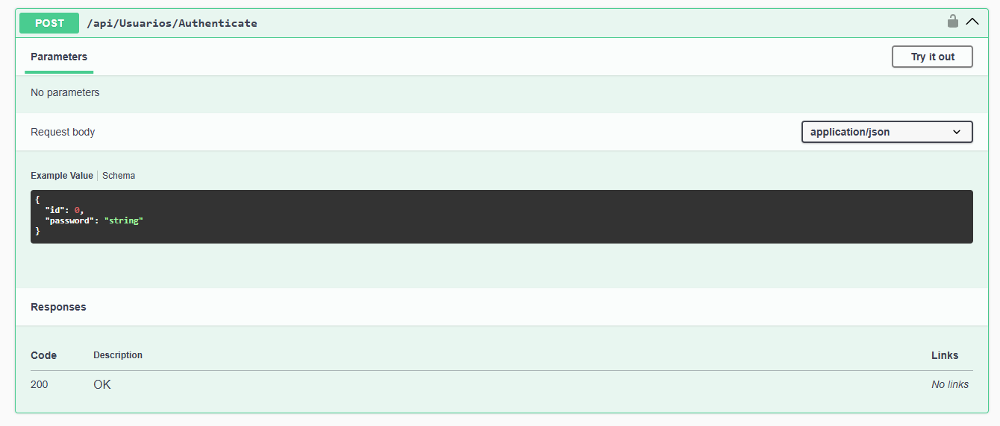


  ### Criar Professor
- **Método:** POST  
- **URL:** /api/Professores  
- **Parâmetros (body JSON):**
  - `usuarioId`: ID do usuário que será professor (int)  
  - `descricao`: Descrição ou especialidade do professor (string)  
- **Resposta:**  
  - **Sucesso (201 Created)**
    ```json
    {
      "id": 1,
      "usuarioId": 1,
      "descricao": "Professor de Matemática",
      "certificacoes": [],
      "competencias": []
    }
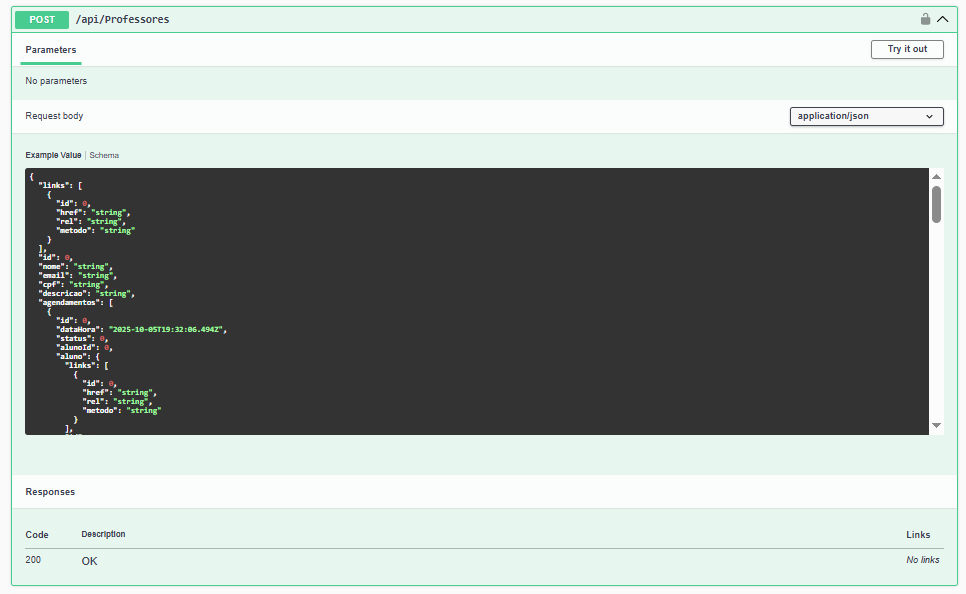
  
  ### Criar Agendamento
- **Método:** POST  
- **URL:** /api/Agendamentos  
- **Parâmetros (body JSON):**
  - `alunoId`: ID do aluno que está agendando (int)  
  - `professorId`: ID do professor (int)  
  - `data`: Data do agendamento (string, formato ISO 8601)  
  - `horaInicio`: Hora de início (string, HH:mm)  
  - `horaFim`: Hora de término (string, HH:mm)  
- **Resposta:**  
  - **Sucesso (201 Created)**
    ```json
    {
      "id": 1,
      "alunoId": 5,
      "professorId": 1,
      "data": "2025-10-05",
      "horaInicio": "08:00",
      "horaFim": "09:00"
    }
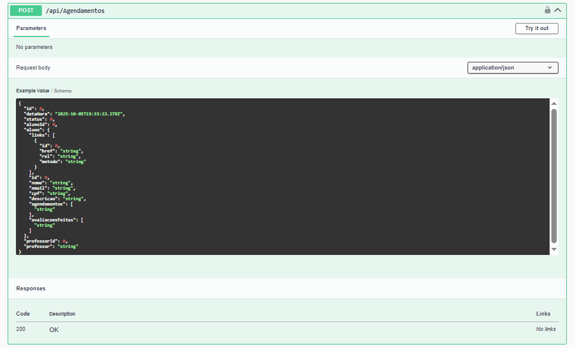

Adicionalmente aos três endpoints detalhados, a API implementa um conjunto padrão de endpoints RESTful (GET, POST, PUT, DELETE) para o gerenciamento dos demais recursos. As imagens a seguir, extraídas da interface Swagger, ilustram a estrutura desses endpoints para `Agendamentos`, `Áreas`, `Avaliações`, `Disponibilidades`, `Professores` e `Usuários`.

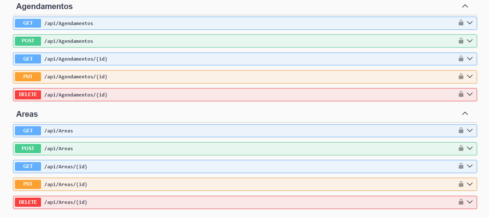
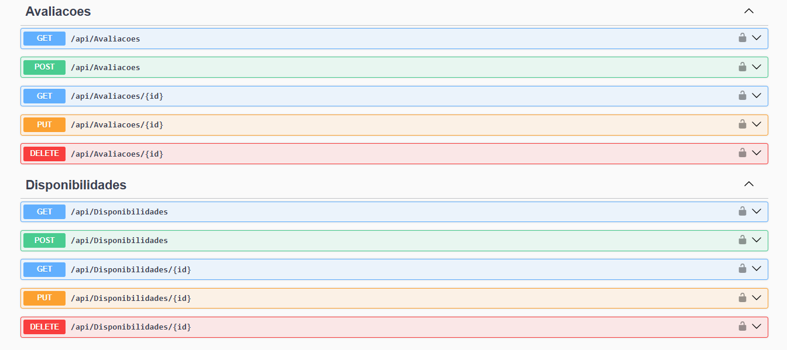
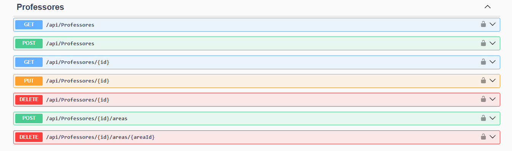
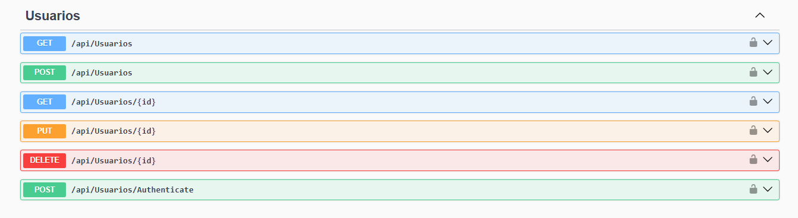


## Considerações de Segurança

A aplicação de agendamento de aulas funciona apenas com conexão segura (HTTPS). O acesso é feito por login em um serviço de identidade confiável. Após entrar, o usuário recebe um “token” de acesso com validade curta (geralmente um JWT). Quando necessário, pode-se exigir confirmação em dois passos (MFA) para ações sensíveis (por exemplo, alterar dados da conta). Todas as entradas são validadas para evitar erros e fraudes, e os dados são armazenados de forma protegida.

A autorização é baseada em perfis e regras claras. Existem perfis como Aluno e Professor, cada um com permissões específicas. Em toda solicitação o sistema verifica se a pessoa tem permissão para aquela ação e se é a “dona” do recurso (ex.: só o professor pode confirmar/cancelar seus próprios horários). As telas e as respostas da API mostram apenas as informações estritamente necessárias a cada perfil (Princípio do Menor Privilégio).

## Implantação
A estratégia de deployment garantirá alta disponibilidade e escalabilidade, baseando-se na AWS com a seguinte arquitetura:
A infraestrutura de produção será construída em uma VPC (Rede Privada), separando o tráfego público do privado. O tráfego externo será recebido por um Application Load Balancer (ALB), que encerrará o HTTPS. A API será executada em contêineres gerenciados por Amazon ECS com AWS Fargate, uma solução serverless que facilitará a escalabilidade. O banco de dados será um SQL Server gerenciado (Amazon RDS), configurado com alta disponibilidade.

Para a segurança da rede, o Amazon RDS será protegido por Security Groups restritivos, permitindo acesso ao banco apenas pela API. Segredos sensíveis (como credenciais do banco) serão armazenados em um cofre de segredos e serão injetados na aplicação via variáveis de ambiente, jamais ficarão no código.

O processo de publicação (Deployment) será repetível e suportará atualizações graduais (blue/green), garantindo que a nova versão será validada antes de receber todo o tráfego. As migrações do Entity Framework para o banco serão aplicadas automaticamente junto com o deploy. Após a disponibilização, a equipe realizará testes práticos em produção e monitorará logs e métricas para garantir que a aplicação estará funcionando corretamente, com a segurança de HTTPS e limites de requisição ativos.

## Testes

## Casos de Testes - Requisitos Funcionais

| **ID**     | **Requisito**                 | **Objetivo**                                                              | **Pré-condição** | **Passos** | **Resultado Esperado** | **Prioridade** |
| :--------- | :---------------------------- | :------------------------------------------------------------------------ | :--------------- | :--------- | :-------------------- | :------------: |
| CT-RF-001  | RF-001 – Gerenciar usuários   | Garantir que seja possível listar todos os usuários cadastrados, criar, editar, listar determinados usuários e exclui-los   | Sistema iniciado e usuário autenticado como admin   | 1. `GET /Usuarios`<br>2. `POST /Usuarios`<br> 3. `GET /Usuarios/{id}`<br>4.`PUT /Usuarios/{id}`<br>5. `DELETE /Usuarios/{id}`<br>6.`POST /Usuarios/Authenticate`  | Usuário é criado, editado, listado e excluído com sucesso    | ALTA           |
| CT-RF-002  | RF-002 – Gerenciar instrutor  | Garantir que seja possível criar, editar, listar e excluir instrutores    | Sistema iniciado e usuário autenticado como admin | 1. `POST /professores`<br>2. `PUT /professores/{id}`<br>3. `GET /professores`<br>4. `DELETE /professores/{id}` | Instrutor é criado, editado, listado e excluído com sucesso | ALTA |
| CT-RF-003  | RF-003 – Consultar instrutores | Garantir que usuários consigam buscar e visualizar detalhes de instrutores | Sistema iniciado | 1. `GET /professores`<br><br>2. `GET /professores/{id}` | Os professores filtrados corretamente e detalhes exibidos | ALTA |
| CT-RF-004  | RF-004 – Gerenciar agendamento | Garantir que usuários consigam criar, alterar e cancelar agendamentos      | Usuário autenticado | 1. `POST /agendamentos`<br>2. `PUT /agendamentos/{id}`<br>3. `DELETE /agendamentos/{id}` | Agendamento criado, alterado ou cancelado com sucesso; conflitos de horário são evitados | ALTA |
| CT-RF-005  | RF-005 – Gerenciar avaliações | Garantir que usuários possam avaliar instrutores ou serem avaliados       | Sistema iniciado e usuário autenticado como admin | 1. `GET /Avaliacoes`<br>2. `POST /Avaliacoes`<br> 3. `GET /Avaliacoes/{id}`<br>4.`PUT /Avaliacoes/{id}`<br>5. `DELETE /Avaliacoes/{id}` | Avaliação é criada, editada, listada e excluída com sucesso    | MÉDIA          |

## Casos de Testes - Requisitos Não Funcionais

| **ID**         | **Requisito**                             | **Objetivo**                                               | **Pré-condição** | **Passos**   | **Resultado Esperado** | **Prioridade** |
| :------------- | :--------------------------------------- | :--------------------------------------------------------- | :--------------- | :----------- | :-------------------- | :------------: |
| CT-RNF-001     | RNF-001 – Responsividade                  | Garantir que a interface se adapte a diferentes dispositivos | Sistema iniciado  | 1. Abrir sistema em desktop, tablet e smartphone | Interface se adapta corretamente sem quebrar layout | ALTO           |
| CT-RNF-002     | RNF-002 – LGPD                            | Garantir conformidade com LGPD                             | Usuário autenticado | 1. Criar usuário com dados pessoais<br>2. Solicitar exclusão de dados | Dados pessoais são tratados conforme LGPD e podem ser excluídos | ALTO           |
| CT-RNF-003     | RNF-003 – HTTPS                           | Garantir comunicação segura                                | Servidor web configurado com certificado SSL/TLS (HTTPS) ativo.         |   1. Acessar qualquer endpoint da API utilizando `https://` no lugar de `http://`.  <br><br>2. Verificar se a conexão é segura (cadeado no navegador ou no Insomnia/Postman).   | Todas as requisições devem ser transmitidas via HTTPS e sem avisos de segurança.            | ALTO           |
| CT-RNF-004     | RNF-004 – Senhas criptografadas           | Garantir segurança das senhas                              | Usuário já registrado no sistema         | 1. Criar novo usuário com senha em texto simples (POST /usuarios).<br><br>2. Verificar no banco de dados se a senha foi armazenada de forma criptografada (hash).<br><br>3. Tentar autenticar usando a senha correta e verificar se o login funciona.    | 1. Senha armazenada no banco não deve ser legível (hash). <br><br>2. Login deve funcionar corretamente usando a senha original.             | ALTO           |
| CT-RNF-005     | RNF-005 – Compatibilidade navegadores     | Garantir funcionamento nos principais navegadores         | Sistema publicado  | 1. Acessar sistema em Chrome, Edge, Firefox, Safari e Opera | Sistema funciona corretamente em todos os navegadores | MÉDIA          |
| CT-RNF-006     | RNF-006 – Compatibilidade sistemas móveis | Garantir funcionamento em Android e iOS                    | A DEFINIR         | A DEFINIR    | A DEFINIR             | MÉDIA          |

# Casos de Teste - Insomnia

## Usuários
### **📒 Autenticação de Usuários**
* **Método:** POST
* **URL:** /Usuarios/Authenticate

✅ Teste: Login com credenciais válidas

* Entrada: Id e senha corretos
* Resultado Esperado: `200 OK` e `"jwtToken": "string"`
* Evidência: 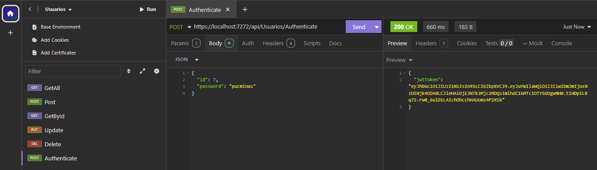

❌ Teste: Login com credenciais inválidas
* Entrada: Id ou senha incorretos
* Resultado Esperado: `401 Unauthorized` com mensagem de erro
* Evidência: 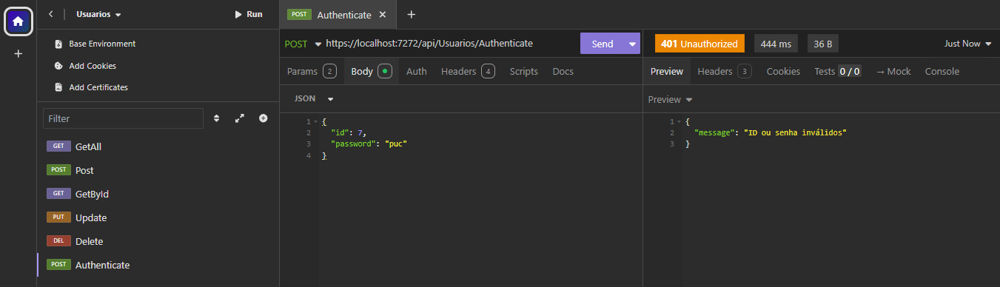


### **📒 Listagem de todos os Usuários cadastrados**
* **Método:** GET
* **URL:** /Usuarios/

✅ Teste: Token válido
* Entrada: Token de autenticação válido
* Resultado Esperado: `200 OK` e lista de usuários cadastrados
* Evidência: 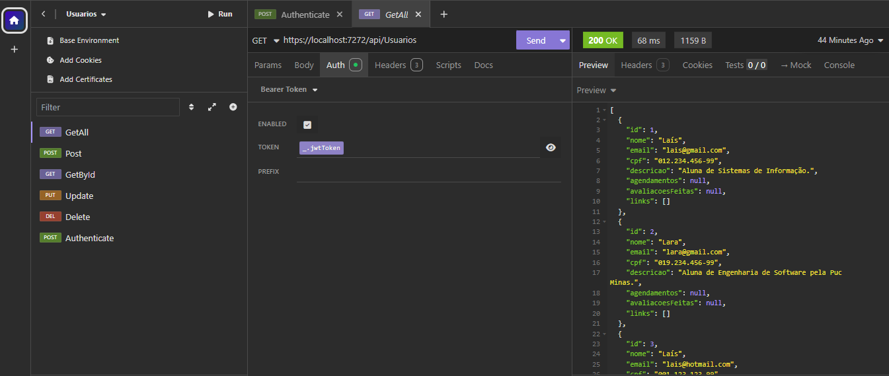

❌ Teste: Token inválido ou expirado
* Entrada: Token incorreto ou gerado a mais de 8 horas
* Resultado Esperado: `401 Unauthorized`
* Evidência: 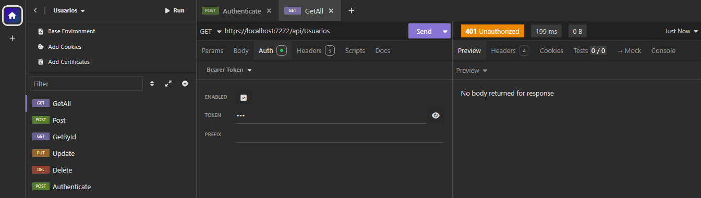

### **📒 Cadastro de novo Usuário**

* **Método:** POST
* **URL:** /Usuarios/

✅ Teste: Todos os dados válidos e preenchidos e token de autenticação válido

* Entrada: JSON com todos os dados obrigatórios preenchidos
* Resultado Esperado: `201 Created` e lista de usuários cadastrados
* Evidência: 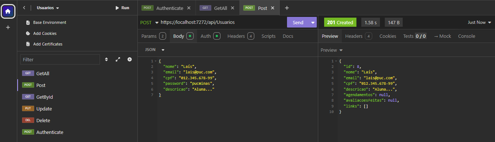

❌ Teste: Token inválido ou expirado
* Entrada: Token incorreto ou gerado a mais de 8 horas
* Resultado Esperado: `401 Unauthorized`
* Evidência: 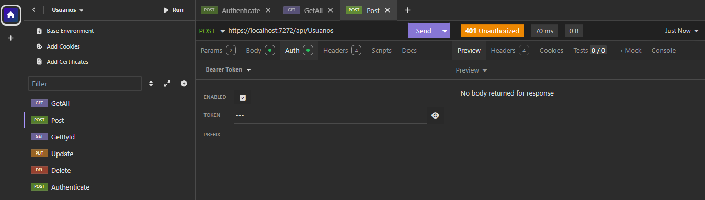

❌ Teste: Falta de dado

* Entrada: Falta de algum dado obrigatório no cadastro
* Resultado Esperado: `400 Bad Request` e mensagem de erro informando qual é o dado que falta
* Evidência: 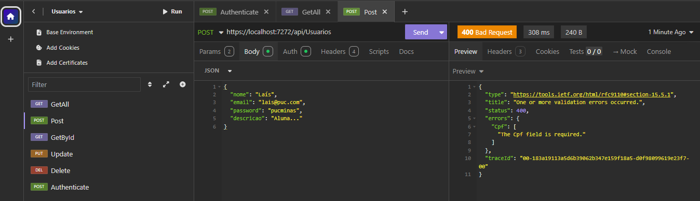

### **📒 Busca por determinado Usuário**

* **Método:** GET
* **URL:** /Usuarios/{id}

✅ Teste: Busca por usuário existente e token de autenticação válido

* Entrada: URL com Id de Usuário válido e existente
* Resultado Esperado: `200 OK` e descrição dos dados do usuário encontrado
* Evidência: 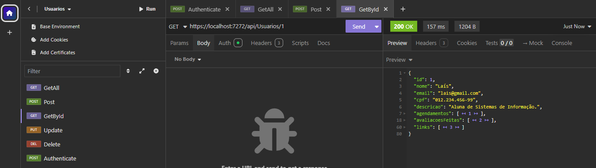

❌ Teste: Token inválido ou expirado
* Entrada: Token incorreto ou gerado a mais de 8 horas
* Resultado Esperado: `401 Unauthorized`
* Evidência: 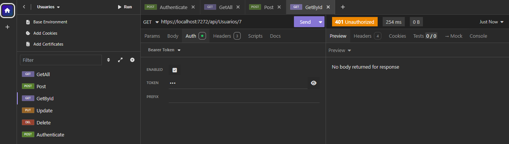

❌ Teste: Usuário não encontrado

* Entrada: Id da URL de usuário ainda não existente
* Resultado Esperado: `404 Not Found` e descrição do erro
* Evidência: 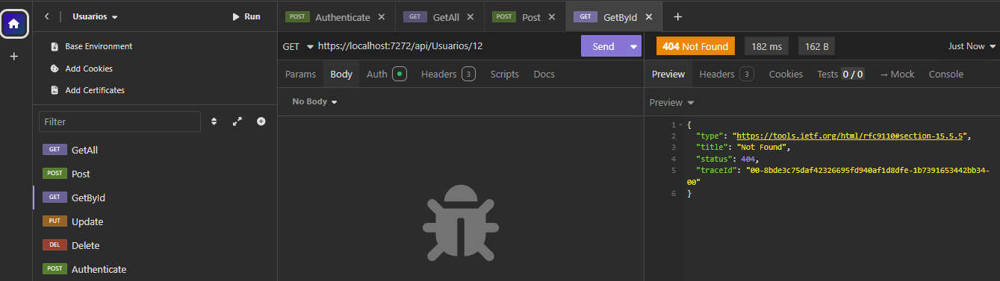

### **📒 Editar determinado Usuário**
* **Método:** PUT
* **URL:** /Usuarios/{id}

✅ Teste: Editar dados de usuário existente e token de autenticação válido

* Entrada: URL com Id de Usuário válido e existente
* Resultado Esperado: `204 No Content`
* Evidência: 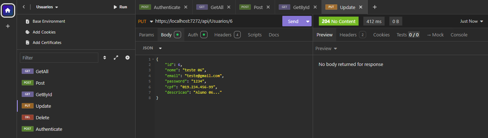

❌ Teste: Token inválido ou expirado

* Entrada: Token incorreto ou gerado a mais de 8 horas
* Resultado Esperado: `401 Unauthorized`
* Evidência: 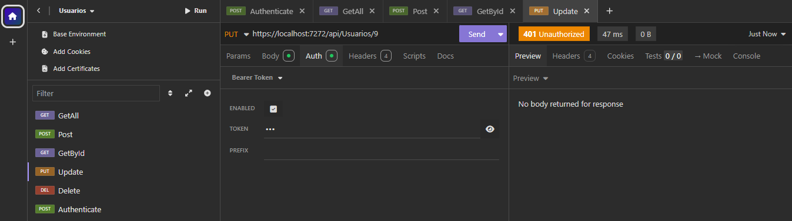

❌ Teste: Usuário não corresponde

* Entrada: Id informado na URL diferente do Id informado na descrição do usuário
* Resultado Esperado: `400 Bad Request` e descrição do erro
* Evidência: 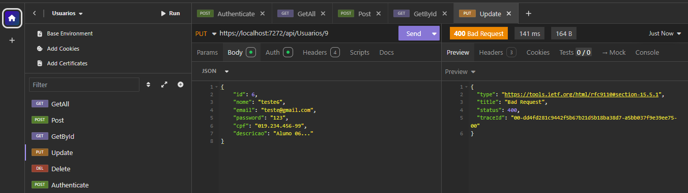

### **📒 Excluir determinado Usuário**
* **Método:** DELETE
* **URL:** /Usuarios/{id}

✅ Teste: Excluir usuário existente e token de autenticação válido

* Entrada: URL com Id de Usuário existente
* Resultado Esperado: `204 No Content`
* Evidência: 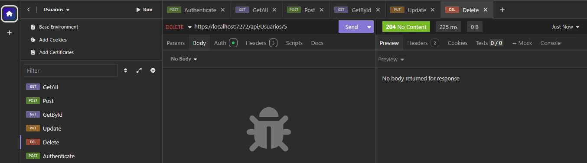

❌ Teste: Token inválido ou expirado

* Entrada: Token incorreto ou gerado a mais de 8 horas
* Resultado Esperado: `401 Unauthorized`
* Evidência: 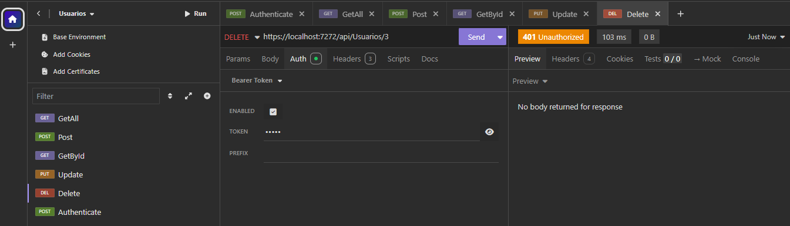

❌ Teste: Usuário não encontrado

* Entrada: Id da URL de usuário não existente
* Resultado Esperado: `404 Not Found` e descrição do erro
* Evidência: 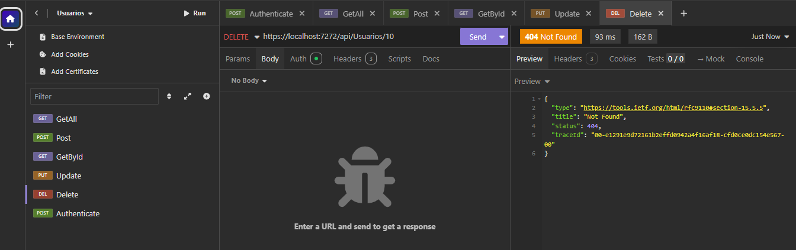

---

## Professores

- **GET /professores/**  
  Lista todos os professores  
  ✅ Teste: Válido
  
  

- **POST /professores/**  
  Cria um novo professor  
  ✅ Teste: Válido

  

- **PUT /professores/{id}**  
  Atualiza um professor existente  
  ✅ Teste: Válido

  


- **DELETE /professores/{id}**  
  Remove um professor  
  ✅ Teste: Válido

  
---
  ## Agendamentos

- **GET /agendamentos/**  
  Lista todos os agendamentos  
  ✅ Teste: Válido

  


- **POST /agendamentos/**  
  Cria um novo agendamento  
  ✅ Teste: Válido

  

- **PUT /agendamentos/{id}**  
  Atualiza um agendamento existente  
  ✅ Teste: Válido

  

- **DELETE /agendamentos/{id}**  
  Remove um agendamento  
  ✅ Teste: Válido
  
  
---
## Disponibilidades

- **GET /disponibilidades/**  
  Lista todas as disponibilidades  
  ✅ Teste: Válido

  

- **POST /disponibilidades/**  
  Cria uma nova disponibilidade  
  ✅ Teste: Válido
  
  

- **PUT /disponibilidades/{id}**  
  Atualiza uma disponibilidade existente  
  ✅ Teste: Válido

  

- **DELETE /disponibilidades/{id}**  
  Remove uma disponibilidade  
  ✅ Teste: Válido

  
---

## Avaliações
### **📒 Listagem de todas as Avaliações cadastradas**

* **Método:** GET
* **URL:** /Avaliacoes/

✅ Teste: Token válido
* Entrada: Token de autenticação válido
* Resultado Esperado: `200 OK` e lista de avaliações cadastradas
* Evidência: 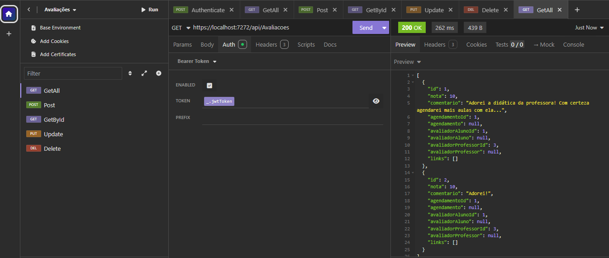

❌ Teste: Token inválido ou expirado
* Entrada: Token incorreto ou gerado a mais de 8 horas
* Resultado Esperado: `401 Unauthorized`
* Evidência: 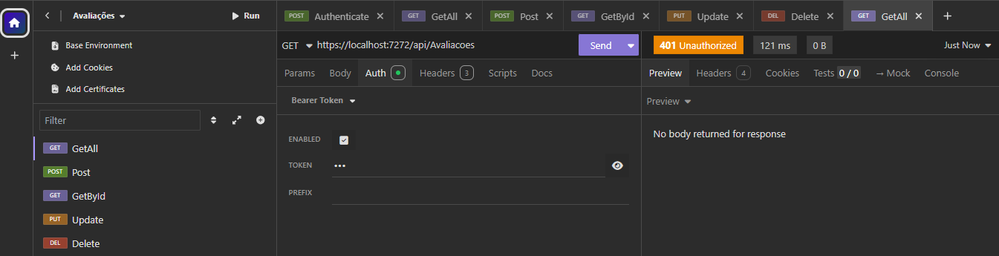

### **📒 Cadastro de nova Avaliação**

* **Método:** POST
* **URL:** /Avaliacoes/

✅ Teste: Todos os dados válidos e preenchidos e token de autenticação válido
* Entrada: JSON com todos os dados obrigatórios preenchidos
* Resultado Esperado: `201 Created` e lista de usuários cadastrados
* Evidência: 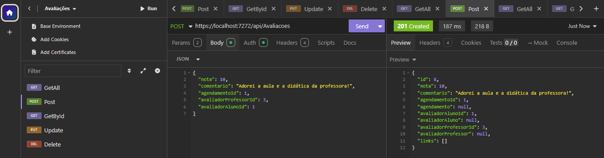

❌ Teste: Token inválido ou expirado
* Entrada: Token incorreto ou gerado a mais de 8 horas
* Resultado Esperado: `401 Unauthorized`
* Evidência: 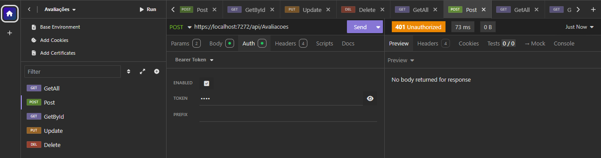

❌ Teste: Ids incorretos
* Entrada: Id de agendamento inexistente ou Id de aluno ou professor que não correspondem aos registrados no agendamento
* Resultado Esperado: `400 Bad Request` e mensagem informando o erro
* Evidência: 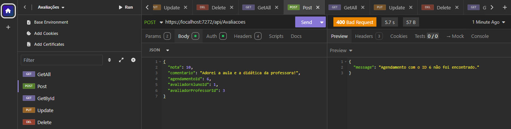 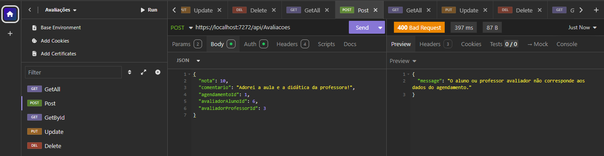

❌ Teste: Falta de dado ou dado incorreto
* Entrada: Falta de algum dado obrigatório no cadastro ou informados de forma incorreta
* Resultado Esperado: `400 Bad Request` e mensagem de erro
* Evidência:  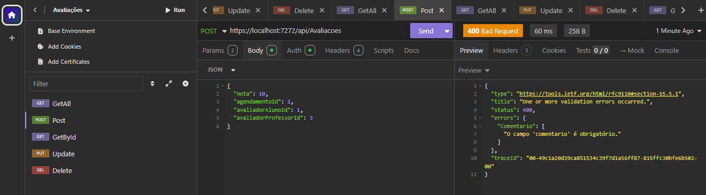 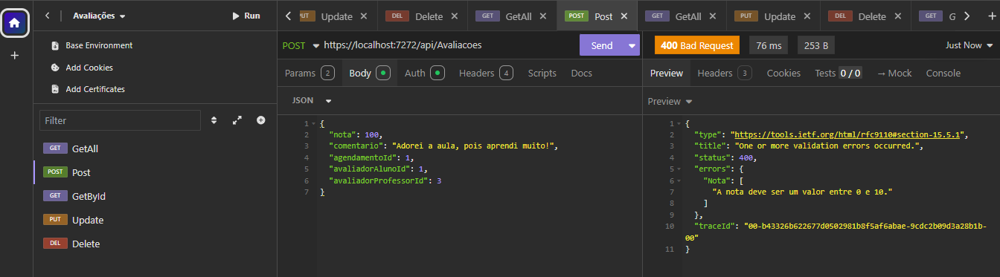


### **📒 Busca por determinada Avaliação**

* **Método:** GET
* **URL:** /Avaliacoes/{id}

✅ Teste: Busca por avaliação existente e token de autenticação válido
* Entrada: URL contendo Id de Avaliação válida e existente
* Resultado Esperado: `200 OK` e descrição dos dados da avaliação encontrada
* Evidência: 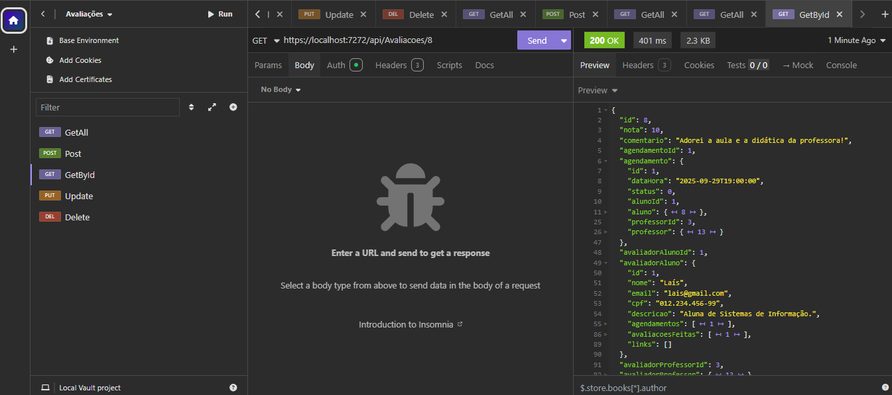

❌ Teste: Token inválido ou expirado
* Entrada: Token incorreto ou gerado a mais de 8 horas
* Resultado Esperado: `401 Unauthorized`
* Evidência: 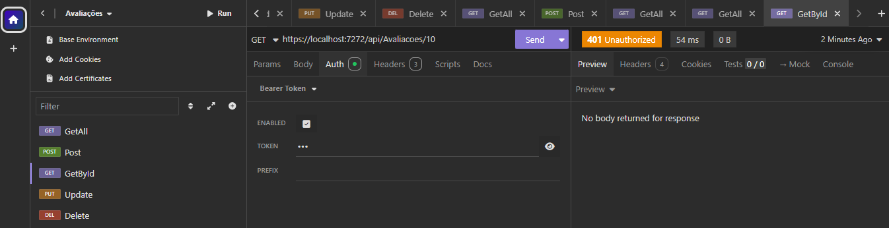

❌ Teste: Avaliação não encontrada
* Entrada: URL contendo um Id de avaliação ainda não existente
* Resultado Esperado: `404 Not Found` e descrição do erro
* Evidência: 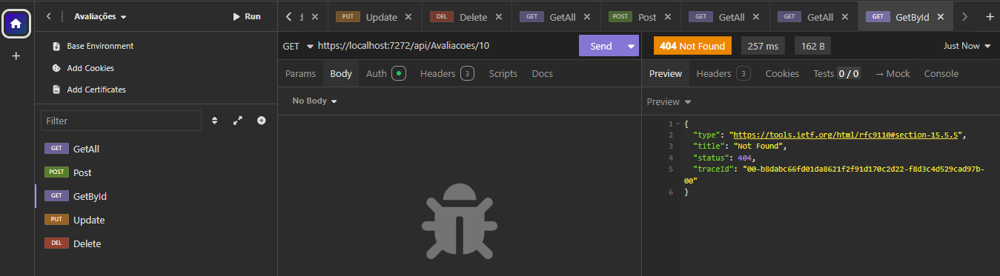


### **📒 Editar Avaliação**

* **Método:** PUT
* **URL:** /Avaliacoes/{id}

✅ Teste: Editar dados de avaliação existente e token de autenticação válido
* Entrada: URL com Id de Avaliação válida e existente
* Resultado Esperado: `204 No Content`
* Evidência: 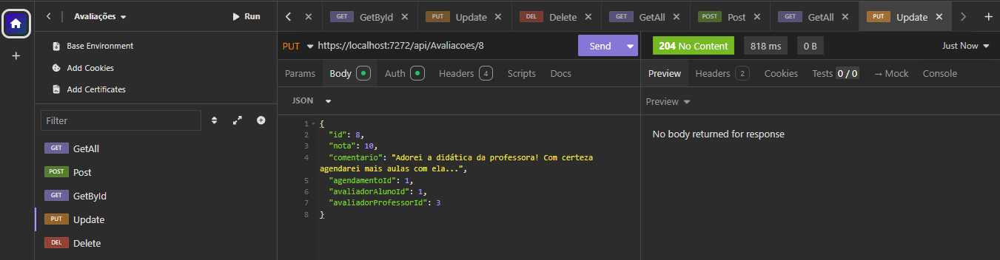

❌ Teste: Token inválido ou expirado
* Entrada: Token incorreto ou gerado a mais de 8 horas
* Resultado Esperado: `401 Unauthorized`
* Evidência: 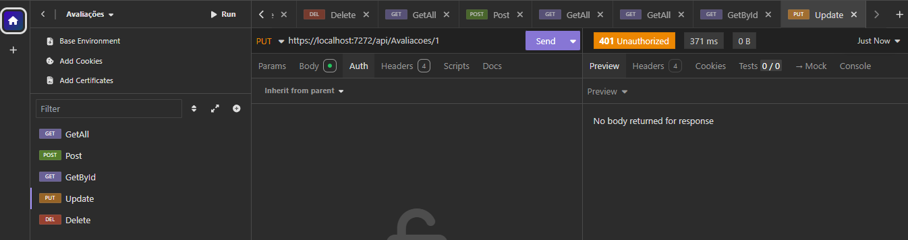

❌ Teste: Avaliação não corresponde
* Entrada: URL com Id diferente do Id informado na descrição da avaliação
* Resultado Esperado: `400 Bad Request` e descrição do erro
* Evidência: 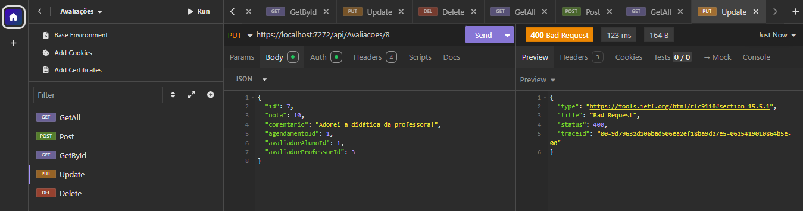


### **📒 Excluir Avaliação**
* **Método:** DELETE
* **URL:** /Avaliacoes/{id}

✅ Teste: Excluir avaliação existente e token de autenticação válido
* Entrada: URL com Id de Avaliação existente
* Resultado Esperado: `204 No Content`
* Evidência: 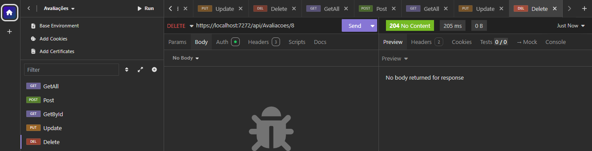

❌ Teste: Token inválido ou expirado
* Entrada: Token incorreto ou gerado a mais de 8 horas
* Resultado Esperado: `401 Unauthorized`
* Evidência: 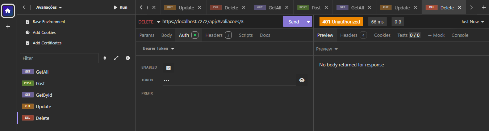

❌ Teste: Avaliação não encontrada
* Entrada: URL com Id de Avaliação não existente
* Resultado Esperado: `404 Not Found` e descrição do erro
* Evidência: 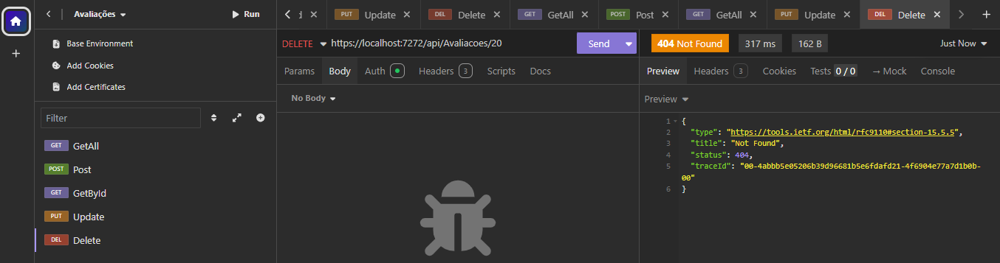
---

## Áreas
### **📒 Listagem de todas as Áreas cadastradas**
* **Método:** GET
* **URL:** /Areas/

✅ Teste: Token válido
* Entrada: Token de autenticação válido
* Resultado Esperado: `200 OK` e lista de áreas cadastradas
* Evidência: 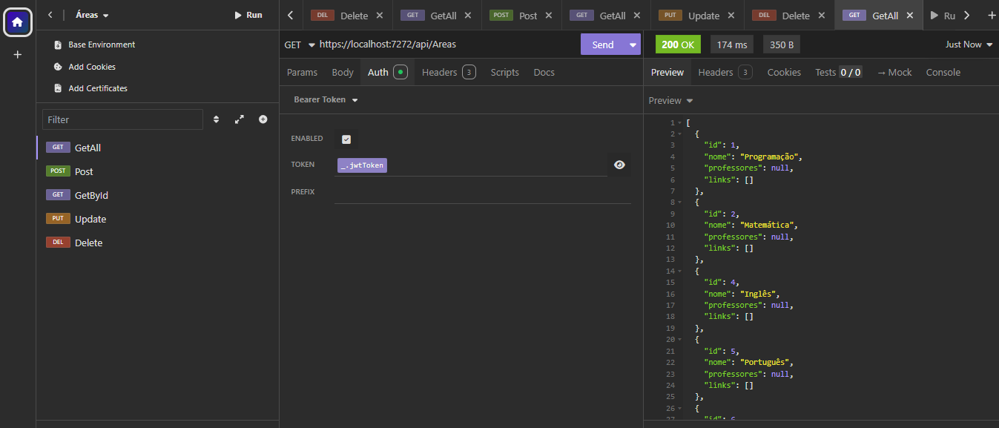

❌ Teste: Token inválido ou expirado
* Entrada: Token incorreto ou gerado a mais de 8 horas
* Resultado Esperado: `401 Unauthorized`
* Evidência: 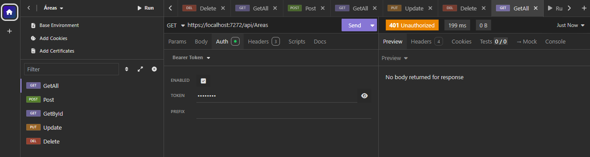

### **📒 Cadastro de nova Área**
* **Método:** POST
* **URL:** /Areas/

✅ Teste: Todos os dados válidos e preenchidos e token de autenticação válido
* Entrada: JSON com o dado de "nome" obrigatório devidamente preenchido
* Resultado Esperado: `201 Created` e exibe a nova área cadastrada
* Evidência: 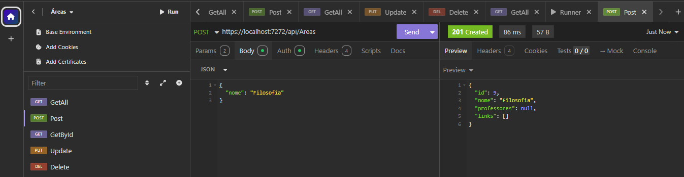

❌ Teste: Token inválido ou expirado
* Entrada: Token incorreto ou gerado a mais de 8 horas
* Resultado Esperado: `401 Unauthorized`

### **📒 Busca por determinada Área**
* **Método:** GET
* **URL:** /Areas/{id}

✅ Teste: Busca por área existente e token de autenticação válido
* Entrada: URL contendo Id de Área válida e existente
* Resultado Esperado: `200 OK` e descrição dos dados da área encontrada
* Evidência: 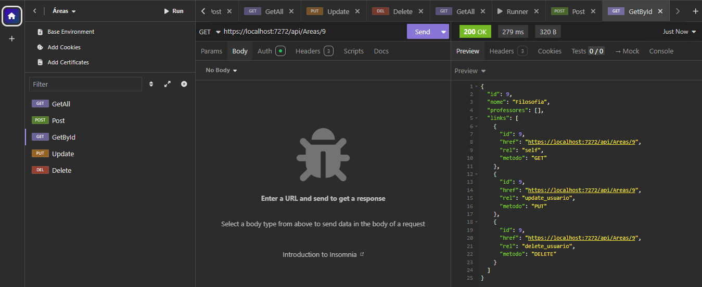

❌ Teste: Token inválido ou expirado
* Entrada: Token incorreto ou gerado a mais de 8 horas
* Resultado Esperado: `401 Unauthorized`

❌ Teste: Área não encontrada
* Entrada: URL contendo um Id de área que ainda não existente
* Resultado Esperado: `404 Not Found` e descrição do erro
* Evidência: 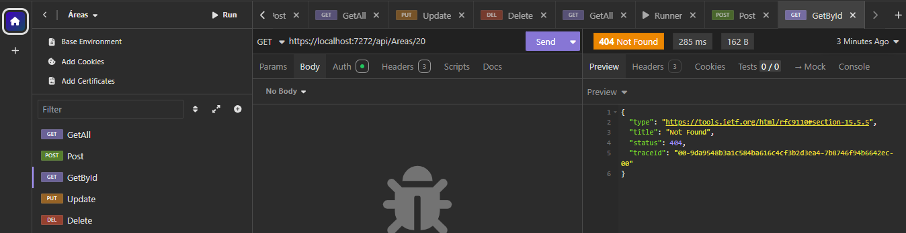

### **📒 Editar Área**

* **Método:** PUT
* **URL:** /Areas/{id}

✅ Teste: Editar nome de Área existente e token de autenticação válido
* Entrada: URL com Id de Área válida e existente
* Resultado Esperado: `204 No Content`
* Evidência: 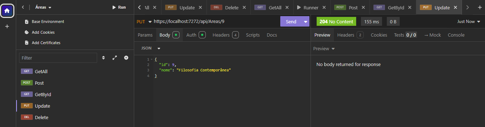

❌ Teste: Token inválido ou expirado
* Entrada: Token incorreto ou gerado a mais de 8 horas
* Resultado Esperado: `401 Unauthorized`

❌ Teste: Área não corresponde
* Entrada: URL com Id diferente do Id informado na descrição da área
* Resultado Esperado: `400 Bad Request` e descrição do erro
* Evidência: 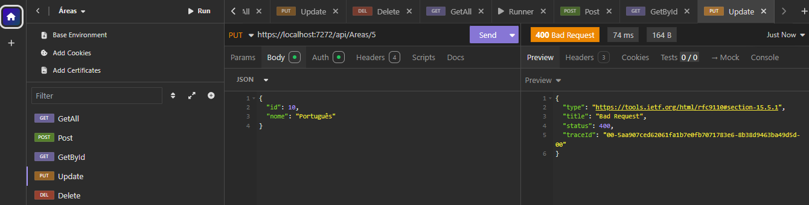

### **📒 Excluir Área**
* **Método:** DELETE
* **URL:** /Areas/{id}

✅ Teste: Excluir área existente e token de autenticação válido
* Entrada: URL com Id de Área existente
* Resultado Esperado: `204 No Content`
* Evidência: 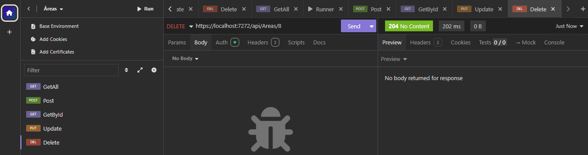

❌ Teste: Token inválido ou expirado
* Entrada: Token incorreto ou gerado a mais de 8 horas
* Resultado Esperado: `401 Unauthorized`

❌ Teste: Área não encontrada
* Entrada: URL com Id de Avaliação não existente
* Resultado Esperado: `404 Not Found` e descrição do erro
* Evidência: 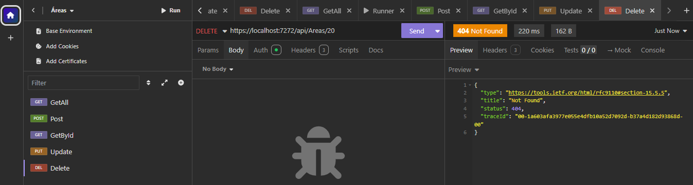

# Referências

Para o desenvolvimento deste projeto, as seguintes ferramentas e documentações foram utilizadas como referência:
* Visual Studio Community: https://visualstudio.microsoft.com/pt-br/vs/community/
* Insomnia REST Client: https://insomnia.rest/
* Visão Geral do ASP.NET Core: https://learn.microsoft.com/pt-br/aspnet/core/overview?view=aspnetcore-6.0
* Microsoft SQL Server 2022: https://www.microsoft.com/pt-br/sql-server/sql-server-2022
* Entity Framework Tutorial - DevMedia: https://www.devmedia.com.br/entity-framework-tutorial/27764

# Planejamento

##  Quadro de tarefas

### Semana 1

Atualizado em: 12/09/2025

| Responsável   | Tarefa/Requisito | Iniciado em    | Prazo      | Status | Terminado em    |
| :----         |    :----         |      :----:    | :----:     | :----: | :----:          |
| Todos do grupo (em reunião) | Definição de próximos passos e distribuição das tarefas entre os integrantes.| 01/09/2025   | 01/09/2025 | ✔️    | 01/09/2025    |


#### Semana 2

Atualizado em: 12/09/2025

| Responsável   | Tarefa/Requisito | Iniciado em    | Prazo      | Status | Terminado em    |
| :----         |    :----         |      :----:    | :----:     | :----: | :----:          |
| Laís Lara, Antônio Rubens e Sávio Sérgio  | Criação, desenvolvimento e revisão da apresentação da etapa 1.  | 03/09/2025   | 08/09/2025 | ✔️ | 08/09/2025  |
| Laís Lara e Antônio Rubens | Apresentação da etapa 1.  | 08/09/2025   | 08/09/2025 | ✔️ | 08/09/2025  |
| Laís Lara, Beatriz Pereira e Sávio Sérgio | Elaboração do Diagrama de Classes do projeto | 10/09/2025 | 14/09/2025 | ✔️  |              12/09/2025 |
| Laís Lara e Beatriz Pereira | Início da Criação da API do projeto | 12/09/2025 | 16/09/2025 | ✔️  |  04/10/2025   |


### Semana 3

Atualizado em: 05/10/2025

| Responsável   | Tarefa/Requisito | Iniciado em    | Prazo      | Status | Terminado em    |
| :----         |    :----         |      :----:    | :----:     | :----: | :----:          |
| Laís Lara Ferreira dos Santos | Criação e configuração das classes e controllers de "Usuário", "Avaliações" e "Áreas"| 15/09/2025   | 21/09/2025 | ✔️    | 21/09/2025    |
| Beatriz Pereira da Costa | Criação e configuração das classes e controllers de "Professores", "Agendamentos" e "Disponibilidade"| 15/09/2025   | 21/09/2025 | ✔️    | 21/09/2025    |


### Semana 4

Atualizado em: 05/10/2025
| Responsável   | Tarefa/Requisito | Iniciado em    | Prazo      | Status | Terminado em    |
| :----         |    :----         |      :----:    | :----:     | :----: | :----:          |
| Laís Lara Ferreira dos Santos | Configuração da relação muitos para muitos entre professor e área | 22/09/2025   | 28/09/2025 | ✔️    | 28/09/2025    |
| Beatriz Pereira da Costa | Correções da classe "Professor" | 22/09/2025   | 28/09/2025 | ✔️    | 28/09/2025    |


#### Semana 5

Atualizado em 04/09/2025
| Responsável   | Tarefa/Requisito | Iniciado em    | Prazo      | Status | Terminado em    |
| :----         |    :----         |      :----:    | :----:     | :----: | :----:          |
| Laís Lara Ferreira dos Santos | Configuração da autenticação do projeto | 29/09/2025   | 03/10/2025 | ✔️    | 03/10/2025    |
| Laís Lara Ferreira dos Santos | Descrição do Endpoint de Usuário | 04/10/2025   | 05/10/2025 | ✔️    | 05/10/2025    |
| Laís Lara Ferreira dos Santos | Realização e documentação dos testes de "Usuários", "Avaliações" e "Áreas" | 04/10/2025   | 05/10/2025 | ✔️    | 05/10/2025    |
| Laís Lara Ferreira dos Santos | Revisão geral na documentação | 05/10/2025   | 05/10/2025 | ✔️    | 05/10/2025    |
| Beatriz Pereira da Costa | Configuração da autorização do projeto | 29/09/2025   | 03/10/2025 | ✔️    | 03/10/2025    |
| Beatriz Pereira da Costa | Descrição dos End-points e tabela de testes de requisitos do projeto | 03/10/2025   | 05/10/2025 | ✔️    | 04/10/2025    |
| Antônio Rubens  | Apoio com a elaboração  da documentação  | 04/10/2025   | 05/10/2025 | 📝 | 05/10/2025  |
| Denis Alves da Silva Leite  | Teste de API  | 04/10/2025   | 05/10/2025 | ✔️  | 05/10/2025  |
| Arthur Neves da Silveira  | Testes de API  | 04/10/2025   | 05/10/2025 | ✔️  | 05/10/2025  |
| Sávio Sérgio Pereira da Silva | Revisão da documentação | 05/10/2025 | 05/10/2025 |✔️  | 05/10/2025  |


Legenda:
- ✔️: terminado
- 📝: em execução
- ⌛: atrasado
- ❌: não iniciado

