# Front-end Móvel

O projeto Saber+ é uma plataforma de conexão para aulas particulares, englobando busca filtrada por professores, agendamento e gestão de disponibilidade entre professores e alunos. Esta fase é dedicada ao desenvolvimento do Frontend Mobile. O objetivo é construir uma interface multiplataforma que permita aos usuários consultar, interagir e executar operações essenciais no sistema distribuído, consumindo dados do backend principal.
A prioridade é entregar uma experiência de usuário intuitiva, performática e acessível para dispositivos móveis, garantindo a portabilidade e a otimização para telas menores.

## Projeto da Interface

Este projeto tem como objetivo desenvolver uma interface mobile com foco em Usabilidade e um design moderno e minimalista.
O sistema visa facilitar a gestão de agendamentos, permitindo que os alunos agendem atendimentos de forma rápida e prática, enquanto os profissionais podem visualizar e organizar seus horários de maneira eficiente.

### Wireframes

## Homepage

---

## Login

---

## Cadastro
### Etapa 1

### Etapa 2

---

## Buscar

### Design Visual

O design visual da aplicação _Saber+_ foi desenvolvido com base em princípios de consistência, acessibilidade e escalabilidade. 

No restante da aplicação, adotamos uma **paleta predominante de tons azuis**, proporcionando uma experiência visual agradável e confiável, já que o azul está associado à tranquilidade e estabilidade.

A tipografia principal do projeto é Lato, escolhida por sua estética moderna e alta legibilidade em diferentes tamanhos e contextos de tela.

## Fluxo de Dados

 
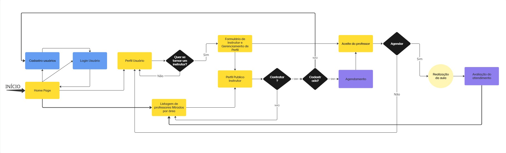

## Tecnologias Utilizadas
O desenvolvimento do projeto envolveu diversas tecnologias que, em conjunto, permitiram a construção de uma aplicação mobile funcional, organizada e de fácil manutenção. A seguir, são descritas as principais ferramentas e linguagens utilizadas:

* **React Native 0.82:** Framework mobile responsável por renderizar componentes nativos em Android e iOS, permitindo desenvolvimento multiplataforma com JavaScript/TypeScript.
* **React 19:** Biblioteca base para construção dos componentes e gerenciamento do ciclo de vida e estado da interface.
* **TypeScript 5.8:** Camada de tipagem estática utilizada para aumentar a segurança, previsibilidade e robustez do código durante o desenvolvimento.
* **Node.js 20+:** Ambiente de execução JavaScript utilizado para gerenciamento de dependências, scripts de build e execução das ferramentas do ecossistema React Native.
* **React Navigation:** Biblioteca de navegação usada para estruturar o fluxo da aplicação através de tabs e stacks, garantindo transições e gerenciamento de rotas.
* **AsyncStorage:** Mecanismo de armazenamento local assíncrono utilizado para persistir dados simples no dispositivo (tokens, preferências, cache leve).
* **Metro + Babel:** Ferramentas responsáveis pela transpilação e empacotamento do código, garantindo compatibilidade, otimização e hot reload durante o desenvolvimento.
* **ESLint + Prettier:** Conjunto de ferramentas de linting e formatação automática para padronizar o código e prevenir erros comuns.
* **Jest:** Framework de testes utilizado para escrever e executar testes unitários garantindo confiabilidade dos componentes e funções.
* **CLI oficial Android/iOS:** Ferramentas nativas das plataformas utilizadas para compilar, rodar e depurar o aplicativo nos emuladores e dispositivos físicos.
* **Ngrok:** Serviço de tunelamento utilizado para expor temporariamente a API backend em uma URL pública, permitindo que o app mobile acesse endpoints hospedados localmente durante o desenvolvimento (Evidência 1: https://drive.google.com/file/d/1LVE3IZa9Lxt6Q57511bvMqNhSTpMNZlw/view?usp=sharing; Evidência 2: https://drive.google.com/file/d/1m7Kqyrr4fCSZ7JcUuZ_bMwOpI7pgMNN0/view?usp=sharing) 

## Considerações de Segurança

Em aplicações distribuídas, a segurança é um aspecto fundamental para garantir a integridade, confidencialidade e disponibilidade das informações. No contexto de um Frontend Mobile Nativo com React Native, diversas medidas são cruciais para proteger o aplicativo contra vulnerabilidades e acessos indevidos.

* **Autenticação:** Implementação de fluxos de autenticação com JWT Token através de APIs do backend. O token de acesso deve ser armazenado de forma segura no dispositivo.
* **Autorização:** O frontend deve respeitar as permissões do usuário para exibir ou ocultar elementos/funcionalidades, mas a autorização final e crítica deve sempre ser validada pelo backend antes de processar qualquer requisição.
* **Validação de Entrada:** Validação rigorosa dos dados inseridos pelo usuário no aplicativo antes de serem enviados ao backend.
* **Criptografia de Dados Sensíveis:** Uso de módulos nativos ou bibliotecas confiáveis de React Native (ex: react-native-keychain ou Secure Storage APIs) para armazenar tokens, senhas e chaves localmente.
* **Controle de Sessão:** Monitoramento da validade dos JWTs tokens. Implementar a expiração automática e a funcionalidade de revalidação de token para manter a sessão ativa de forma segura, exigindo um novo login após a expiração.
* **Uso de HTTPS:** Garantir que todas as comunicações com o backend sejam feitas exclusivamente via HTTPS. Considerar a implementação de SSL Pinning para mitigar ataques Man-in-the-Middle (MITM), garantindo que o app só se comunique com o servidor esperado.

## Implantação
A implantação da aplicação mobile em um ambiente de produção exige a definição clara dos requisitos, a preparação da infraestrutura e a garantia de segurança em todo o processo.
### 1. Requisitos de Hardware e Software
Para a etapa mobile, o ambiente de produção deve contar no mínimo com as seguintes configurações:
* Node.js 20+ para execução de scripts, build e gerenciamento de dependências.
* Java 17+, Android SDK e Xcode (macOS) para geração das builds Android e iOS.
* Gerenciador de pacotes (npm ou Yarn).
* Ambiente CI/CD opcional (GitHub Actions, GitLab CI, Bitrise ou App Center).
* Servidor para backend (nuvem, on-premise ou dedicado) com API acessível via HTTPS.

### 2. Plataforma de Hospedagem
A escolha da plataforma depende do tipo de entrega:
* Android: Publicação no Google Play Console.
* iOS: Publicação via App Store Connect (exige macOS).
* Backend/API: Pode ser hospedado em AWS, Azure, Render, Railway, Digital Ocean ou servidor dedicado.
* Arquivos estáticos e assets: Podem ser entregues via CDN.

### 3. Configuração do Ambiente de Implantação
Antes de gerar as builds, é necessário:
* Instalar dependências via npm install ou yarn.
* Configurar variáveis de ambiente (URLs da API, chaves, tokens).
* Definir versões de build, ícones, splash e permissões.
* Ajustar arquivos nativos de cada plataforma (AndroidManifest.xml, Info.plist).
* Executar otimizações do Metro + Babel para bundle final.
* Validar a estrutura de navegação com React Navigation e persistência com AsyncStorage.

### 4. Deploy da Aplicação Mobile
Após a preparação do ambiente:
* **Para Android:**
* Gerar o APK/AAB usando gradlew bundleRelease.
* Assinar digitalmente a build.
* Enviar para o Google Play Console.
* **Para iOS:**
* Gerar o build release pelo Xcode.
* Assinar utilizando certificados da Apple.
* Enviar via Transporter ou diretamente pelo Xcode para o App Store Connect.
*	Backend
*	Hospedar a API em ambiente seguro (cloud ou dedicado).
*	Ajustar endpoints públicos.
*	Se necessário, usar Ngrok temporariamente durante homologação.

### 5. Testes em Produção
Depois do deploy, devem ser realizados:
* Testes funcionais gerais.
* Testes de navegação e fluxo de telas.
* Validação da comunicação backend via HTTPS.
* Verificação do armazenamento local via AsyncStorage.
* Execução dos testes unitários com Jest.
* Testes em dispositivos reais Android e iOS.

## Testes

### Caso de teste: Cadastrar Aluno
* Entrada: Nome, E-mail, Senha, Confirmar senha, CPF e descrição.
* Resposta esperada: Mensagem de cadastro realizado com sucesso e solicitando login.
* Evidências:

 <table >
   <tbody>
     <tr>
       <td>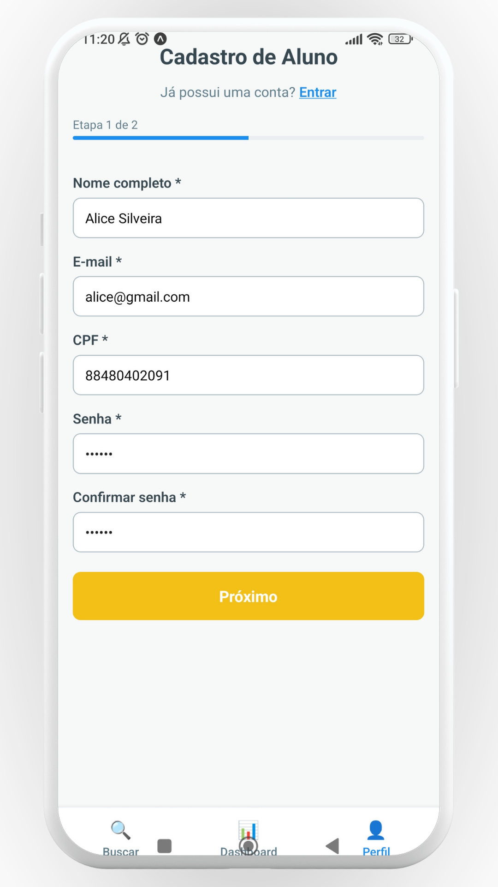 
Inserir dados de cadastro.
</td>
       <td>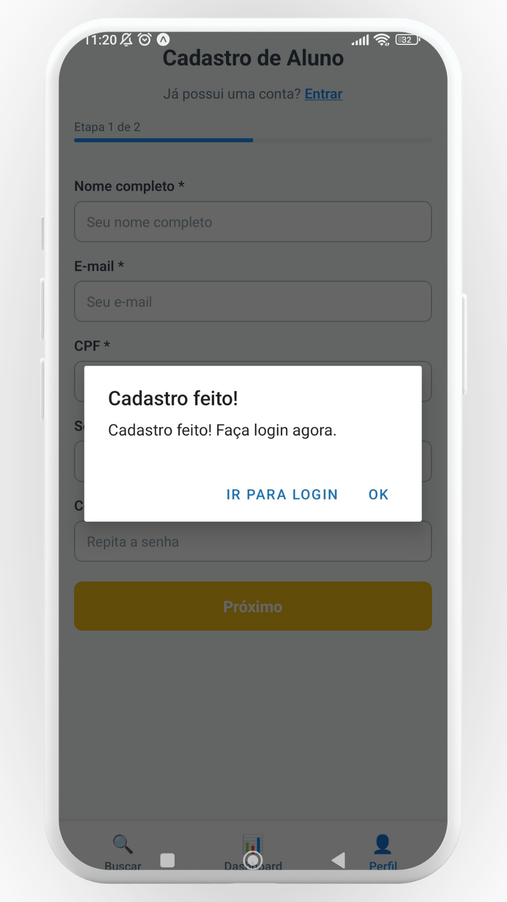
Mensagem de sucesso.
</td>
     </tr>
   </tbody>
 </table>

### Caso de teste: Cadastrar Professor
* Entrada: Nome completo, E-mail, Senha, CPF, Descrição, Certificações, Competências e Valor da hora-aula.
* Resposta esperada: Cadastro criado com sucesso e direcionamento para o login.
* Evidência:

 <table >
   <tbody>
     <tr>
       <td> 
Inserir dados de cadastro.
</td>
       <td>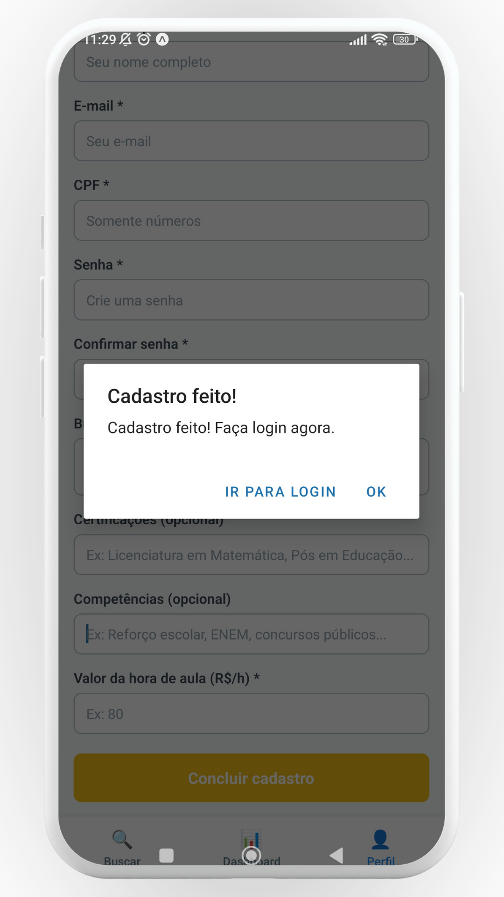
Mensagem de sucesso.
</td>
     </tr>
   </tbody>
 </table>

### Caso de teste: Login Usuário
* Entrada: E-mail e senha de usuário já cadastrado na plataforma.
* Resposta esperada: Login realizado com sucesso e direcionamento para a tela de perfil do usuário.
* Evidência:

 <table >
   <tbody>
     <tr>
       <td>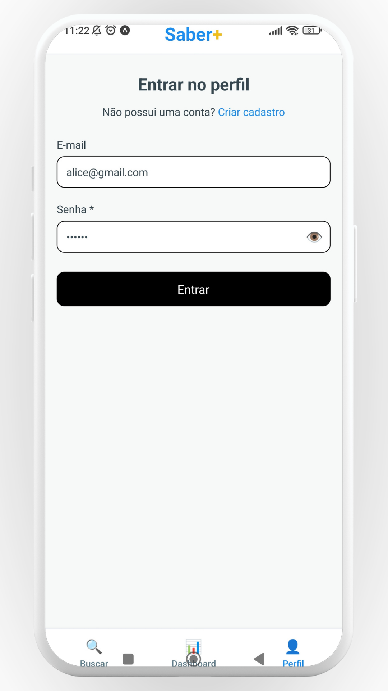 
Inserir dados de entrada.
</td>
       <td>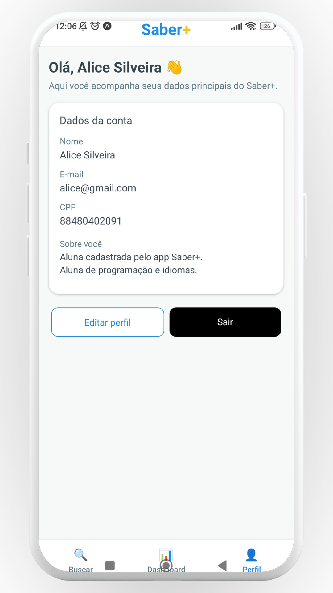
Usuário é direcionado para seu perfil.
</td>
     </tr>
   </tbody>
 </table>

### Caso de teste: Editar Perfil de Usuário do tipo Aluno
* Entrada: Inserir os dados que deseja alterar, como nome, e-mail ou descrição e inserir a senha para confirmar a ação.
* Resposta esperada: Mensagem de sucesso e dados alterados no banco de dados.
* Evidência:

 <table >
   <tbody>
     <tr>
       <td>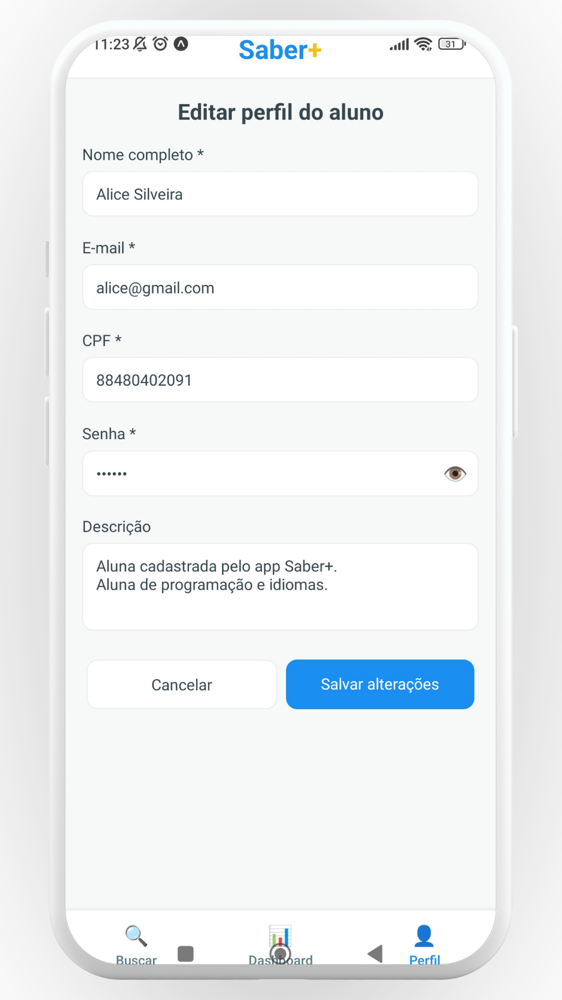 
Alterar dados.
</td>
       <td>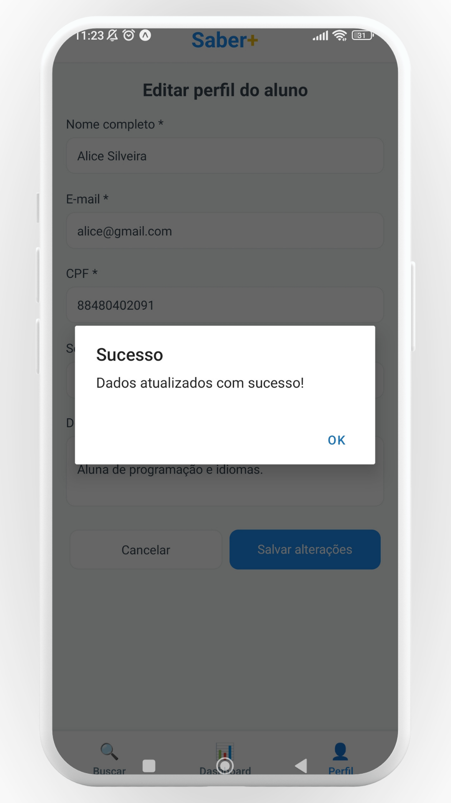
Mensagem de sucesso.
</td>
     </tr>
   </tbody>
 </table>

 <table >
   <tbody>
     <tr>
       <td> 
Alterar dados.
</td>
       </tr>
   </tbody>
 </table>

### Caso de teste: Editar Perfil de Usuário do tipo Professor
* Entrada: Inserir os dados que deseja alterar, como nome, e-mail, descrição, certificações, competências ou valor da hora-aula e inserir a senha para confirmar a ação.
* Resposta esperada: Mensagem de sucesso e dados alterados no banco de dados.
* Evidência:

 <table >
   <tbody>
     <tr>
       <td>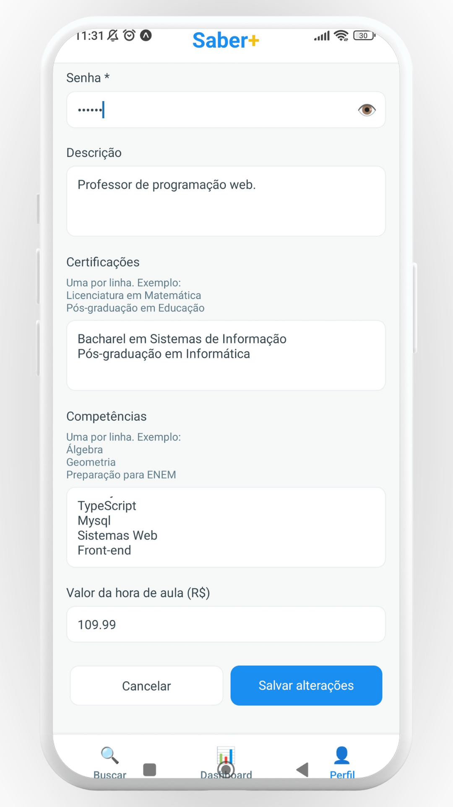 
Alterar dados.
</td>
       <td>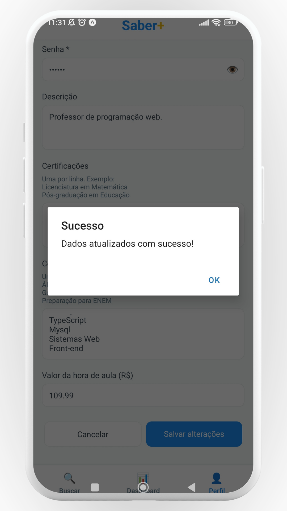
Mensagem de sucesso.
</td>
     </tr>
   </tbody>
 </table>

### Caso de teste: Filtrar Professor por Nome, Competências ou Certificações durante a busca
* Entrada: Acessar a opção de "Buscar" e inserir nome, competência ou certificação do professor.
* Resposta esperada: Aplicação do filtro na listagem e atualização da lista com professores que atendam o requisito.
* Evidência:

 <table >
   <tbody>
     <tr>
       <td>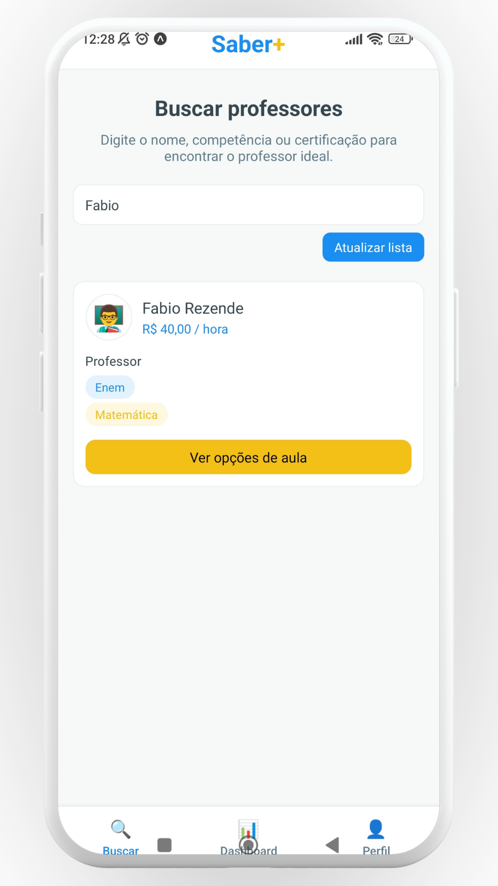
Filtro por nome.
</td>
       <td>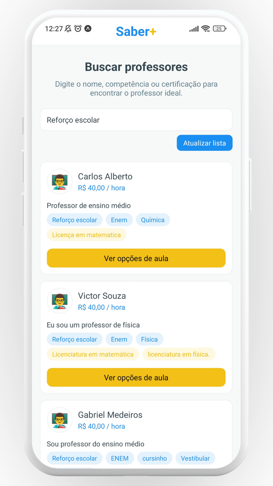
Filtro por competências.
</td>
       <td>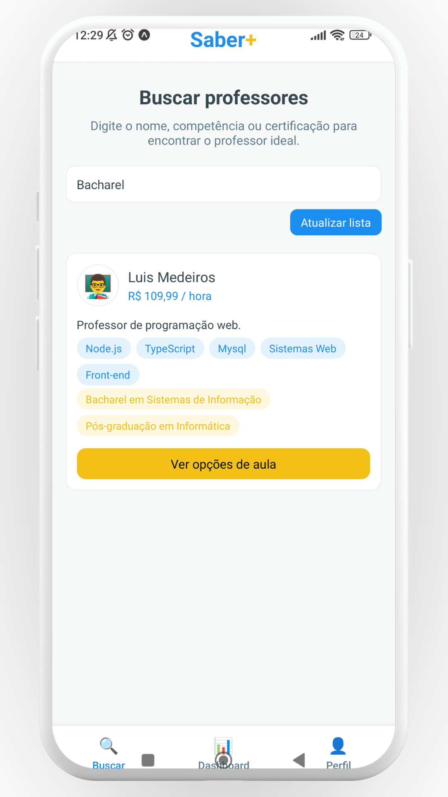
Filtro por certificações.
</td>
     </tr>
   </tbody>
 </table>

### Caso de teste: Registrar Agendamento
* Entrada: Escolher professor da listagem, clicar em "Ver opções de aula", escolher um dos horários disponíveis do professor clicando no botão "Escolher este horário" e na tela seguinte confirmar as informações do professor e da aula clicando em "Agendar neste horário".
* Resposta esperada: Mensagem de sucesso, agendamento registrado no banco de dados e disponível para verificação no dashboard do professor e do aluno.
* Evidência:

 <table >
   <tbody>
     <tr>
       <td>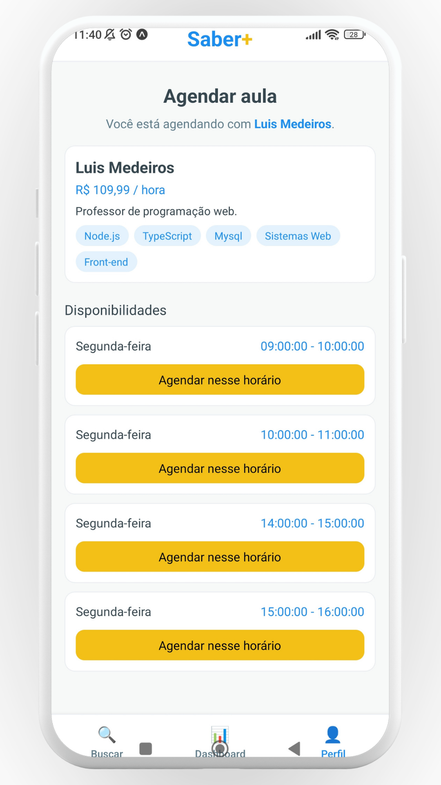 
Confirmar dados do professor e da aula.
</td>
       <td>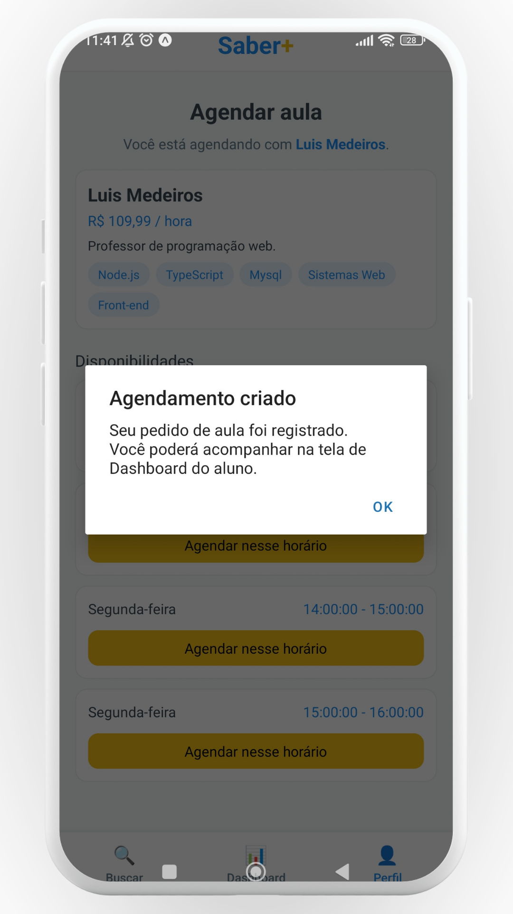
Mensagem de sucesso.
</td>
       <td>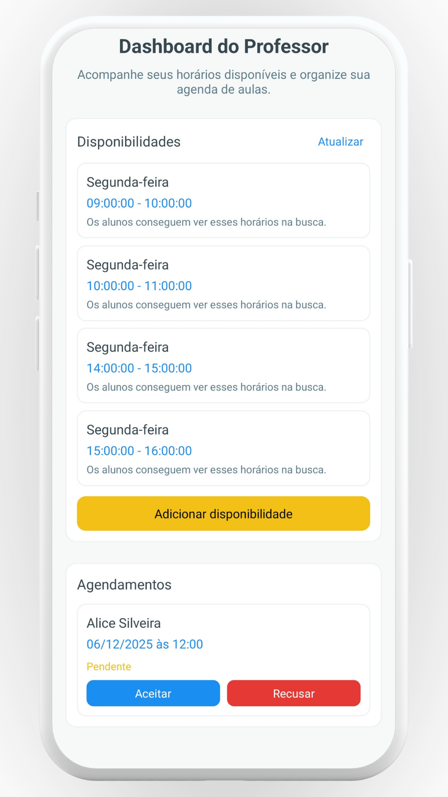
Agendamento no dashboard do professor.
</td>
     </tr>
   </tbody>
 </table>

# Referências

- https://reactnative.dev/
- https://pt-br.legacy.reactjs.org/
- https://pucminas.instructure.com/courses/155666 - Eixo 6 - Microfundamento: Desenvolvimento de Aplicações Móveis
- https://dashboard.ngrok.com/get-started/setup/windows

# Planejamento

##  Quadro de tarefas

### Semana 1

Atualizado em: 21/04/2024

| Responsável   | Tarefa/Requisito | Iniciado em    | Prazo      | Status | Terminado em    |
| :----         |    :----         |      :----:    | :----:     | :----: | :----:          |
| Arthur Neves da Silveria        | Criação dos Wireframes do App mobile via Figma | 03/02/2025     | 12/02/2025 | ✔️    | 06/02/2025      |
| Denis Alves da Silva Leite| Desenho das interfaces no Figma | 03/11/2025     | 10/11/2025 | ✔️    | 30/11/2025      |

#### Semana 2

Atualizado em: 21/04/2024

| Responsável   | Tarefa/Requisito | Iniciado em    | Prazo      | Status | Terminado em    |
| :----         |    :----         |      :----:    | :----:     | :----: | :----:          |
| Arthur Neves da Silveria        | Elaboração do Protótipo pela plataforma da Expo | 13/02/2025     | 19/02/2025 | ✔️    | 18/02/2025      |
| Denis Alves da Silva Leite| Criação das páginas em React Native | 06/11/2025     | 10/11/2025 | ✔️    | 30/11/2025      |

#### Semana 3

Atualizado em: 01/12/2025

| Responsável   | Tarefa/Requisito | Iniciado em    | Prazo      | Status | Terminado em    |
| :----         |    :----         |      :----:    | :----:     | :----: | :----:          |
| Laís Lara F. dos Santos | Configuração do tunelamento da API local.  | 26/11/2025   | 30/11/2025 | ✔️    | 29/11/2025  |
| Beatriz Pereira da Costa| Tunelamento da API local via Ngrok  | 26/11/2025   | 30/11/2025 | ✔️    | 30/11/2025  |
| Beatriz Pereira da Costa| Ajustes de Endpoints da API via Banco de Dados  | 26/11/2025   | 30/11/2025 | ✔️    | 30/11/2025  |
| Denis Alves da Silva Leite| Contribui para o mobile funcionar com API via tunelamento| 29/11/2025     | 30/11/2025 | ✔️    | 30/11/2025      |

#### Semana 4

Atualizado em: 01/12/2025

| Responsável   | Tarefa/Requisito | Iniciado em    | Prazo      | Status | Terminado em    |
| :----         |    :----         |      :----:    | :----:     | :----: | :----:          |
| Laís Lara F. dos Santos  | Descrição dos tópicos de Tecnologias Utilizadas, Segurança e listagem dos Casos de Teste necessários na documentação.  | 30/11/2025  | 01/12/2025 | ✔️  | 01/12/2025    |
| Sávio Sérgio Pereira da Silva  | Trabalhei na elaborado do documento: Projeto de interface  | 01/12/2025  | 01/12/2025 | ✔️  | 01/12/2025    |
| Antonio Rubens Oliveira Junqueira  | Trabalhei na elaborado do documento.  | 01/12/2025  | 01/12/2025 | ✔️  | 01/12/2025    |
| Antonio Rubens Oliveira Junqueira  | Trabalhei na elaborado do documento e estudos de caso.  | 05/12/2025  | 07/12/2025 | ✔️  | 07/12/2025    |
| Laís Lara F. dos Santos  | Realização dos testes da aplicação mobile e descrição deles no documento.  | 06/12/2025  | 07/12/2025 | ✔️  | 06/12/2025    |
| Denis Alves da Silva Leite| Contribui para que o projeto mobile ficasse online via Expo para outros fazerem os testes | 28/11/2025     | 29/11/2025 | ✔️    | 30/11/2025      |

Legenda:
- ✔️: terminado
- 📝: em execução
- ⌛: atrasado
- ❌: não iniciado

