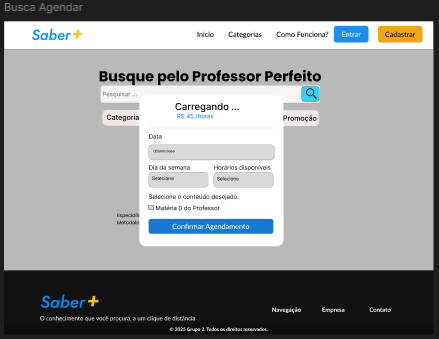

# Front-end Web

[Inclua uma breve descrição do projeto e seus objetivos.]

O projeto Saber+ consiste em uma aplicação Web que oferece uma plataforma de conexão entre professores e alunos para agendamento de aulas particulares, avaliação de serviços e gerenciamento de disponibilidade. Esta etapa consiste no desenvolvimento de uma interface web interativa para uma aplicação distribuída, cujo objetivo é permitir que usuários consultem, interajam e realizem operações em um sistema com backend. A interface será responsiva, acessível e intuitiva, visando atender tanto usuários em desktop quanto em dispositivos móveis.

## Projeto da Interface Web

[Descreva o projeto da interface Web da aplicação, incluindo o design visual, layout das páginas, interações do usuário e outros aspectos relevantes.]

Este projeto de front-end tem como objetivo desenvolver uma interface web com foco em Usabilidade e um design moderno e minimalista.
O sistema visa facilitar a gestão de agendamentos, permitindo que os alunos agendem atendimentos de forma rápida e prática, enquanto os profissionais podem visualizar e organizar seus horários de maneira eficiente.

### Wireframes
[Inclua os wireframes das páginas principais da interface, mostrando a disposição dos elementos na página.]

- Wireframe da tela Home Page

- Wireframe da tela login

- Wireframe da tela cadastro professor

- Wireframe da tela cadastro aluno

- Wireframe da tela finalização de cadastro do professor

- Wireframe da tela edição de perfil aluno

- Wireframe da tela edição de perfil professor

### Design Visual

[Descreva o estilo visual da interface, incluindo paleta de cores, tipografia, ícones e outros elementos gráficos.]

O design visual da aplicação Saber+ foi desenvolvido com base nos princípios de design para garantir consistência, escalabilidade e acessibilidade em toda a interface, utilizando um sistema robusto de variáveis de design.

Essas variáveis representam decisões visuais reutilizáveis, como cores, tipografia, espaçamento e formas, e são implementadas como variáveis CSS customizadas no projeto (:root). Isso permite fácil manutenção, personalização e a rápida evolução do tema.

A paleta de cores foi definida para estabelecer uma hierarquia clara e acessível, usando variáveis que representam seus papéis na interface:

- --cor-primaria (#F2C016): Cor principal utilizada para elementos de destaque e ações primárias (botões, links).
- --cor-secundaria (#1B8EF2): Cor secundária para elementos complementares ou estados ativos.
- --cor-texto (#37474F): Cor escura principal para o conteúdo textual, garantindo alta legibilidade.
- --cor-fundo (#F7F9F9): Cor de fundo geral da aplicação, proporcionando uma superfície clara.
- --white (#FFF): Utilizada para textos em fundos escuros e superfícies de componentes.
- --cor-sucesso (#4CAF50): Cor utilizada para indicar operações bem-sucedidas.
- --cor-alerta (#FF9800): Cor utilizada para indicar avisos, alertas ou erros.
- Cores Adicionais (--cor-1, --cor-2, --cor-3, --cor-4): Cores de suporte para gráficos, ilustrações ou diferentes estados de componentes. 

Fontes:

- `--fonte-titulo` (`'Poppins', Sans-serif`):** Fonte designada para títulos principais e cabeçalhos.
- `--fonte-texto` (`'Lato', serif`):** Fonte designada para o corpo do texto e elementos de interface.
        
Escala de Tamanhos: Uma escala modular de tamanhos de fonte em rem garante consistência e facilidade de adaptação a diferentes telas (de --font-size-xs a --font-size-5xl).

Espaçamento e Layout:

O espaçamento é definido usando uma escala numérica de tokens (spacing-1 a spacing-20), baseada em múltiplos de 0.25rem (ou 4px), garantindo uma estrutura coerente e responsiva:

- Pequeno (--spacing-1 a --spacing-3): Usado para espaçamento interno de componentes ou elementos agrupados.
- Padrão (--spacing-4 a --spacing-6): Espaçamento comum entre elementos ou seções.
- Amplo (--spacing-8 a --spacing-20): Usado para separação de grandes blocos de conteúdo ou margens de página.

Formas e Componentes:

A aparência dos componentes é padronizada através de variáveis de forma e estilo:

- --raio-borda (8px): Raio de borda padrão para botões, campos de entrada e cartões, conferindo uma aparência moderna e suave.
- --sombra-card: Sombra sutil utilizada em cartões e modais para criar profundidade e destaque.
- --transition-normal: Define a duração e tipo de transição para interações de interface, como estados hover ou cliques.
    
## Fluxo de Dados

[Diagrama ou descrição do fluxo de dados na aplicação.]

## Tecnologias Utilizadas
[Lista das tecnologias principais que serão utilizadas no projeto.]

## Considerações de Segurança

[Discuta as considerações de segurança relevantes para a aplicação distribuída, como autenticação, autorização, proteção contra ataques, etc.]

## Implantação

[Instruções para implantar a aplicação distribuída em um ambiente de produção.]

1. Defina os requisitos de hardware e software necessários para implantar a aplicação em um ambiente de produção.
2. Escolha uma plataforma de hospedagem adequada, como um provedor de nuvem ou um servidor dedicado.
3. Configure o ambiente de implantação, incluindo a instalação de dependências e configuração de variáveis de ambiente.
4. Faça o deploy da aplicação no ambiente escolhido, seguindo as instruções específicas da plataforma de hospedagem.
5. Realize testes para garantir que a aplicação esteja funcionando corretamente no ambiente de produção.

## Testes

### Caso de teste: Cadastrar Aluno
* Entrada:
* Resposta esperada:
* Evidência:

### Caso de teste: Cadastrar Professor
* Entrada:
* Resposta esperada:
* Evidência:

### Caso de teste: Login Usuário
* Entrada:
* Resposta esperada:
* Evidência:

### Caso de teste: Editar Perfil de Usuário Professor
* Entrada:
* Resposta esperada:
* Evidência:

### Caso de teste: Buscar por Professor
* Entrada:
* Resposta esperada:
* Evidência:

### Caso de teste: Filtrar Professor por Área durante a busca
* Entrada:
* Resposta esperada:
* Evidência:

### Caso de teste: Registrar Agendamento
* Entrada:
* Resposta esperada:
* Evidência:

### Caso de teste: Aluno Editar Agendamento
* Entrada:
* Resposta esperada:
* Evidência: 

### Caso de teste: Professor Aceitar/Recusar Agendamento
* Entrada: 
* Resposta esperada: 
* Evidência: 

### Caso de teste: Registrar Avaliação de Agendamento
* Entrada:
* Resposta esperada:
* Evidência:

# Referências

Inclua todas as referências (livros, artigos, sites, etc) utilizados no desenvolvimento do trabalho.

# Planejamento

##  Quadro de tarefas

> Divisão de tarefas entre os membros do grupo e o acompanhamento da execução.

### Semana 1

Atualizado em: 06/10/2025

| Responsável   | Tarefa/Requisito | Iniciado em    | Prazo      | Status | Terminado em    |
| :----         |    :----         |      :----:    | :----:     | :----: | :----:          |
| Sávio Sérgio e Antonio        | Construção do wireframe no Figma | 06/01/2025     |  | ✔️    | 10/10/2025      |

#### Semana 2

Atualizado em: 13/10/2025

| Responsável   | Tarefa/Requisito | Iniciado em    | Prazo      | Status | Terminado em    |
| :----         |    :----         |      :----:    | :----:     | :----: | :----:          |
| Sávio Sérgio        | Página inicial   | 13/10/2025     | - | ✔️    | -     |
| Sávio Sérgio        | CSS unificado - criando links para estilos   | -     | - | 📝    |                 |
| Sávio Sérgio        | Página de login  | 13/10/2025     | - | ⌛     |                 |
| Sávio Sérgio        | Script de login  |  01/01/2024    | 12/03/2025 | ❌    |       |
| Antonio Rubens       | Pagina Busca professor  |  13/09/2025    | 05/10/2025 | ✔️    |       |
| Antonio Rubens       | Pagina Contratar professor  |  13/09/2025    | 05/10/2025 | ✔️    |       |
| Antonio Rubens       | Pagina Agendar  |  13/09/2025    | 05/10/2025 | ✔️    |       |
| Antonio Rubens       | Pagina Perfil Professor  |  13/09/2025    | 05/10/2025 | ✔️    |       |

#### Semana 3

Atualizado em: 20/10/2025

| Responsável   | Tarefa/Requisito | Iniciado em    | Prazo      | Status | Terminado em    |
| :----         |    :----         |      :----:    | :----:     | :----: | :----:          |
| Lais Lara        | Inicio da ligação com a API   | 24/10/2025     | - | ✔️    | -      |

#### Semana 4

Atualizado em: 27/04/2025

| Responsável   | Tarefa/Requisito | Iniciado em    | Prazo      | Status | Terminado em    |
| :----         |    :----         |      :----:    | :----:     | :----: | :----:          |
|      -   | -   | -     | - | -    | -      |

Legenda:
- ✔️: terminado
- 📝: em execução
- ⌛: atrasado
- ❌: não iniciado

