# Front-end Web

O projeto Saber+ consiste em uma aplicação Web que oferece uma plataforma de conexão entre professores e alunos para agendamento de aulas particulares, avaliação de serviços e gerenciamento de disponibilidade. Esta etapa consiste no desenvolvimento de uma interface web interativa para uma aplicação distribuída, cujo objetivo é permitir que usuários consultem, interajam e realizem operações em um sistema com backend. A interface será responsiva, acessível e intuitiva, visando atender tanto usuários em desktop quanto em dispositivos móveis.

## Projeto da Interface Web

Este projeto de front-end tem como objetivo desenvolver uma interface web com foco em Usabilidade e um design moderno e minimalista.
O sistema visa facilitar a gestão de agendamentos, permitindo que os alunos agendem atendimentos de forma rápida e prática, enquanto os profissionais podem visualizar e organizar seus horários de maneira eficiente.

### Wireframes

- Wireframe da tela Home Page

- Wireframe da tela login

- Wireframe da tela cadastro professor

- Wireframe da tela cadastro aluno

- Wireframe da tela edição de perfil aluno
  
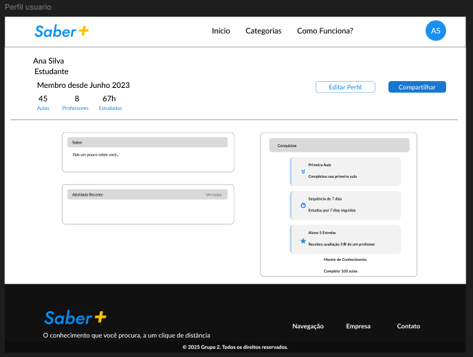

- Wireframe da tela edição de busca por professor  
  
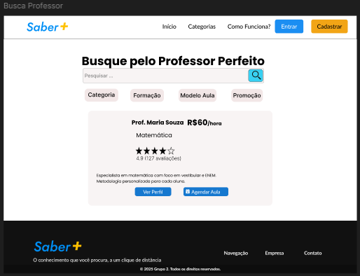

- Wireframe da tela de perfil do professor  
  
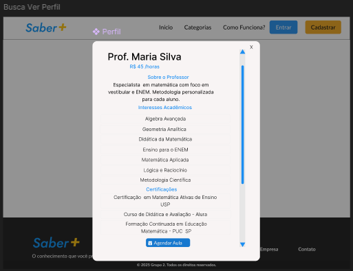

- Wireframe da tela de agendamento  
  

### Design Visual

O design visual da aplicação Saber+ foi desenvolvido com base nos princípios de design para garantir consistência, escalabilidade e acessibilidade em toda a interface, utilizando um sistema robusto de variáveis de design.

Essas variáveis representam decisões visuais reutilizáveis, como cores, tipografia, espaçamento e formas, e são implementadas como variáveis CSS customizadas no projeto (:root). Isso permite fácil manutenção, personalização e a rápida evolução do tema.

A paleta de cores foi definida para estabelecer uma hierarquia clara e acessível, usando variáveis que representam seus papéis na interface:

- --cor-primaria (#F2C016): Cor principal utilizada para elementos de destaque e ações primárias (botões, links).
- --cor-secundaria (#1B8EF2): Cor secundária para elementos complementares ou estados ativos.
- --cor-texto (#37474F): Cor escura principal para o conteúdo textual, garantindo alta legibilidade.
- --cor-fundo (#F7F9F9): Cor de fundo geral da aplicação, proporcionando uma superfície clara.
- --white (#FFF): Utilizada para textos em fundos escuros e superfícies de componentes.
- --cor-sucesso (#4CAF50): Cor utilizada para indicar operações bem-sucedidas.
- --cor-alerta (#FF9800): Cor utilizada para indicar avisos, alertas ou erros.
- Cores Adicionais (--cor-1, --cor-2, --cor-3, --cor-4): Cores de suporte para gráficos, ilustrações ou diferentes estados de componentes. 

Fontes:

- `--fonte-titulo` (`'Poppins', Sans-serif`):** Fonte designada para títulos principais e cabeçalhos.
- `--fonte-texto` (`'Lato', serif`):** Fonte designada para o corpo do texto e elementos de interface.
        
Escala de Tamanhos: Uma escala modular de tamanhos de fonte em rem garante consistência e facilidade de adaptação a diferentes telas (de --font-size-xs a --font-size-5xl).

Espaçamento e Layout:

O espaçamento é definido usando uma escala numérica de tokens (spacing-1 a spacing-20), baseada em múltiplos de 0.25rem (ou 4px), garantindo uma estrutura coerente e responsiva:

- Pequeno (--spacing-1 a --spacing-3): Usado para espaçamento interno de componentes ou elementos agrupados.
- Padrão (--spacing-4 a --spacing-6): Espaçamento comum entre elementos ou seções.
- Amplo (--spacing-8 a --spacing-20): Usado para separação de grandes blocos de conteúdo ou margens de página.

Formas e Componentes:

A aparência dos componentes é padronizada através de variáveis de forma e estilo:

- --raio-borda (8px): Raio de borda padrão para botões, campos de entrada e cartões, conferindo uma aparência moderna e suave.
- --sombra-card: Sombra sutil utilizada em cartões e modais para criar profundidade e destaque.
- --transition-normal: Define a duração e tipo de transição para interações de interface, como estados hover ou cliques.
    
## Fluxo de Dados

 

## Tecnologias Utilizadas
O desenvolvimento do projeto envolveu diversas tecnologias que, em conjunto, permitiram a construção de uma aplicação web funcional, organizada e de fácil manutenção. A seguir, são descritas as principais ferramentas e linguagens utilizadas:

* **HTML:** Responsável pela estruturação das páginas web, ele foi utilizado para definir a disposição dos elementos na interface.
* **CSS:** Empregado para a estilização das páginas, contribuindo para uma melhor experiência do usuário.
* **JavaScript:** Utilizado para adicionar interatividade e dinamismo às páginas, permitindo a manipulação de elementos da interface e a comunicação com a API de forma assíncrona, sem a necessidade de recarregar a página.
* **Visual Studio Code:** Este ambiente de desenvolvimentofoi utilizado para a criação e organização dos arquivos do frontend.
* **ASP.NET Core:** Foi utilizado para o desenvolvimento da API responsável pela lógica de negócio e comunicação entre o frontend e o banco de dados.
* **C#:** Esta linguagem foi utilizada na implementação da API, oferecendo recursos robustos de orientação a objetos e integração nativa com o framework ASP.NET Core.
* **Entity Framework:** Foi adotado como ORM (Object-Relational Mapping) para gerenciar o acesso e a persistência de dados no banco de dados. 
* **SQL Server:** Foi utilizado como sistema gerenciador de banco de dados relacional (SGBD), armazenando e organizando as informações utilizadas pela aplicação. Sua integração com o Entity Framework garantiu maior eficiência nas operações de leitura e escrita de dados.
* **Visual Studio:** Foi empregado como ambiente de desenvolvimento integrado (IDE) para a construção e execução da API.

## Considerações de Segurança

Em aplicações distribuídas, a segurança é um aspecto fundamental para garantir a integridade, confidencialidade e disponibilidade das informações. Dessa forma, diversas medidas preventivas e corretivas são fundamentais para proteger o sistema contra vulnerabilidades e acessos indevidos.

* **Autenticação:** Implementação de mecanismos para garantir que apenas usuários registrados possam acessar as funcionalidades restritas do sistema.
* **Autorização:** Definição de níveis de acesso com base nas permissões do usuário, evitando o uso indevido de recursos por perfis não autorizados.
* **Proteção contra Injeção de SQL:** Utilização do Entity Framework para prevenir ataques de injeção de código nas consultas ao banco de dados.
* **Validação de Entrada:** Verificação dos dados recebidos pelo sistema para evitar a execução de scripts maliciosos e inconsistências nos cadastros.
* **Criptografia de Dados Sensíveis:** Aplicação de técnicas de criptografia para proteger informações confidenciais, como senhas e dados pessoais.
* **Controle de Sessão:** Monitoramento e expiração automática de sessões inativas, reduzindo o risco de acesso não autorizado.
* **Uso de HTTPS:** Configuração do protocolo HTTPS para garantir a comunicação segura entre cliente e servidor, protegendo os dados transmitidos.
* **Monitoramento e Logs:** Registro de atividades do sistema para detecção de comportamentos suspeitos e auditoria de segurança.

## Implantação

Para executar o projeto Saber+, siga estes passos de configuração do ambiente:

* Pré-requisitos: Certifique-se de ter o Visual Studio 2022 (com a carga de trabalho ASP.NET) e o SQL Server (Express ou Developer) instalados.

* Código Fonte: Clone o repositório do projeto via Git: git clone [URL_DO_REPOSITÓRIO].

* Banco de Dados: Abra o SQL Server Management Studio (SSMS) e execute os scripts SQL (ou restaure o backup .bak) para criar o banco de dados "SaberMais".

* Back-end (API): Abra a solução (.sln) da API no Visual Studio 2022. Certifique-se que a connection string (string de conexão) no arquivo appsettings.json aponta para o seu SQL Server local. Pressione "Play" (IIS Express) para executar a API.

* Front-end: http://127.0.0.1:5501/index.html . Abra a pasta do front-end e edite o arquivo JavaScript (ex: api.js) para que a variável de URL corresponda à API em execução.

* Execução: Abra o arquivo index.html no seu navegador.

## Testes

### Caso de teste: Cadastrar Aluno
* Entrada: Nome, E-mail, Senha, Confirmar senha, CPF e descrição
* Resposta esperada: Cadastro realizado com sucesso!
* Evidência:
  - Cadastro realizado com sucesso:
    

  - Verificação de Senha:
    

  - Entrada no Banco de Dados com criptografia de senha:
    

  - Verificar CPF válido:
    

  - Verificar preenchimento de campos obrigatórios:
    

### Caso de teste: Cadastrar Professor
* Entrada: Nome completo, E-mail, Senha, CPF, Descrição, Certificações, Competências e Valor da hora-aula.
* Resposta esperada: Cadastro criado com suvesso e direcionamento para o login.
* Evidência:
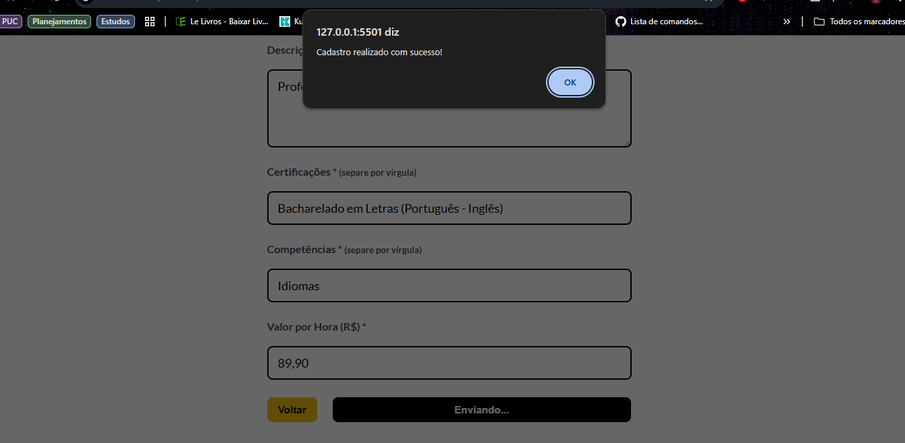

### Caso de teste: Login Usuário
* Entrada: E-mail e senha de usuário já cadastrado na plataforma.
* Resposta esperada: Mensagem de login realizado com sucesso e direcionamento para a homepage.
* Evidência:
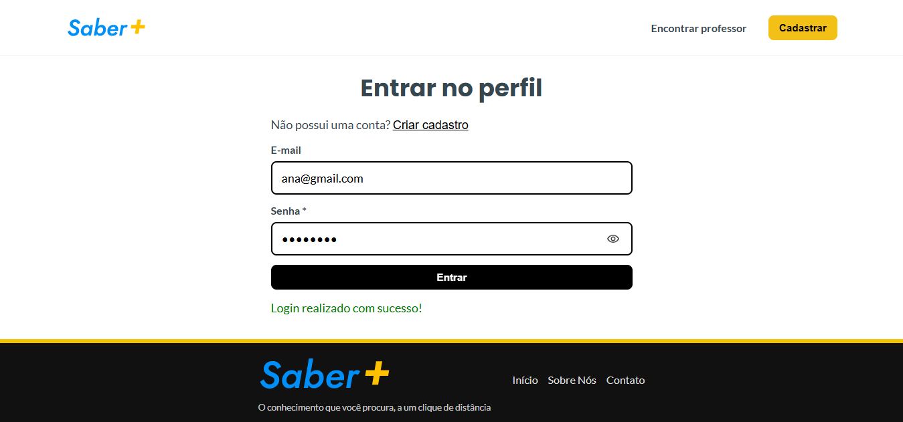
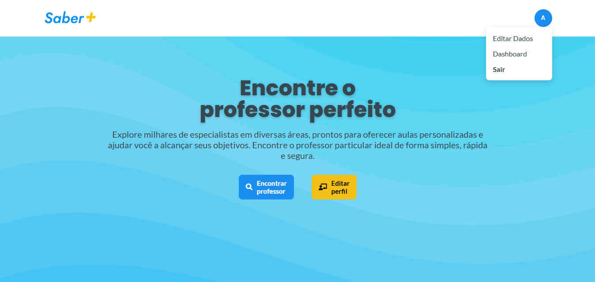

### Caso de teste: Editar Perfil de Usuário do tipo Professor
* Entrada: Inserir os dados que deseja alterar, como nome, e-mail, descrição, certificações, competências, valor da hora-aula, áreas de atuação ou horários disponíveis e senha (para confirmação).
* Resposta esperada: Mensagem de sucesso e dados alterados no banco de dados.
* Evidência:  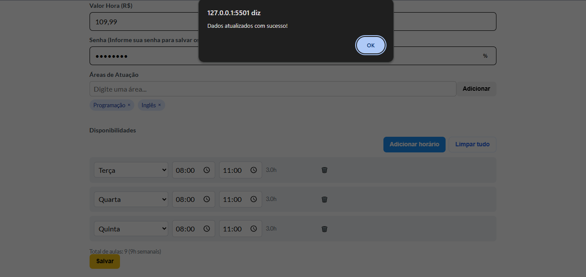

### Caso de teste: Filtrar Professor por Área ou Nome durante a busca
* Entrada: Acessar "buscar-professor.html" e inserir nome, disciplina ou habilidade esperada.
* Resposta esperada: Aplicação do filtro na listagem e atualizar lista com professores que atendam o requisito.
* Evidência: 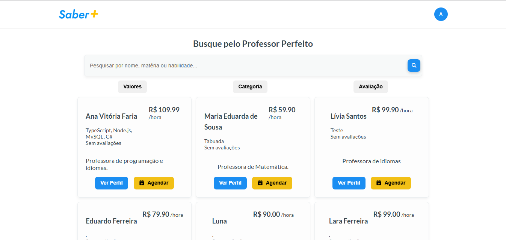
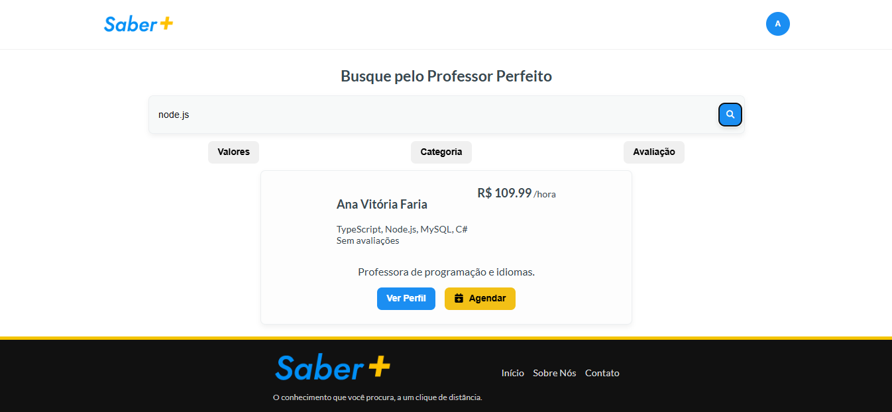

### Caso de teste: Registrar Agendamento
* Entrada: Escolher professor da listagem, clicar em "agendar", inserir data, horário e conteúdo da aula e clicar em "Confirmar Agendamento".
* Resposta esperada: Mensagem de sucesso e agendamento registrado no banco de dados.
* Evidência: 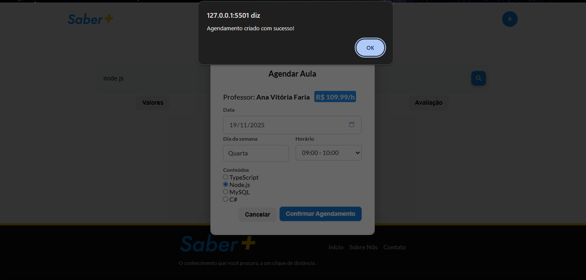

### Caso de teste: Professor Aceitar/Recusar Agendamento
* Entrada: Acessar dashboard do professor, visualizar a lista de "Próximas Aulas" e clicar no botão de "Confirmar" ou "Negar".
* Resposta esperada: Se "Confirmar", o status do agendamento passa a ser "confirmado" e se "Negar", o status do agendamento passa a ser "Cancelado" e é omitido da lista de "Próximas Aulas.
* Evidência:
Aula Confirmada:
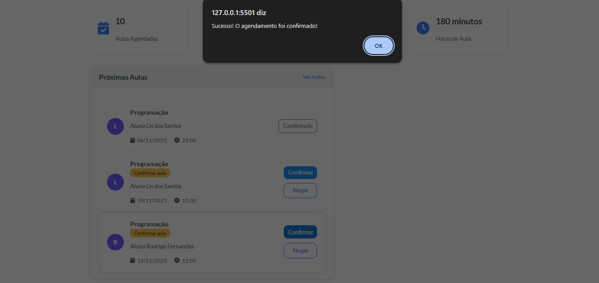
Aula Cancelada:
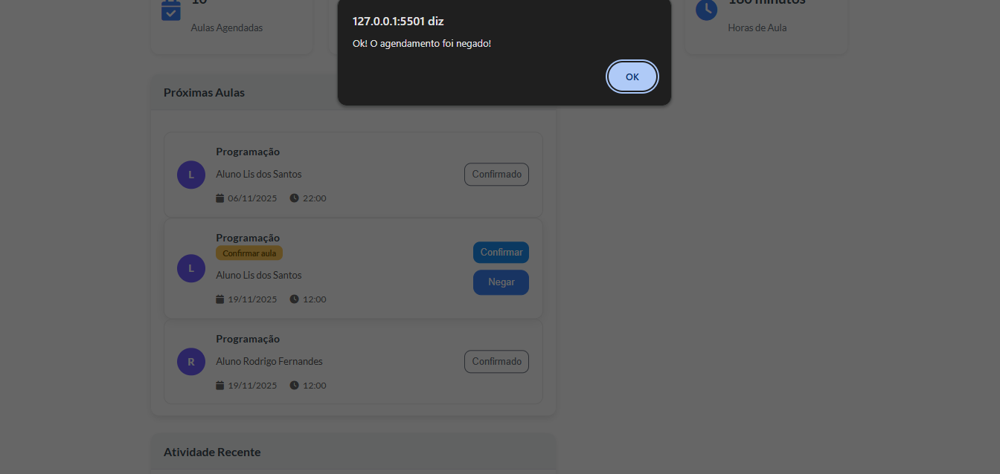

# Referências

 - https://preply.com/
 - https://remotar.com.br/
 - https://www.devmedia.com.br/html-basico-codigos-html/16596
 - https://pucminas.instructure.com/courses/48970 Eixo 1 - Microfundamento: Desenvolvimento Web Front-End

# Planejamento

##  Quadro de tarefas

> Divisão de tarefas entre os membros do grupo e o acompanhamento da execução.

### Semana 1

Atualizado em: 06/10/2025

| Responsável   | Tarefa/Requisito | Iniciado em    | Prazo      | Status | Terminado em    |
| :----         |    :----         |      :----:    | :----:     | :----: | :----:          |
| Sávio Sérgio Pereira da Silva e Antonio        | Construção do wireframe no Figma | 06/01/2025     |  | ✔️    | 10/10/2025      |

#### Semana 2

Atualizado em: 13/10/2025

| Responsável   | Tarefa/Requisito | Iniciado em    | Prazo      | Status | Terminado em    |
| :----         |    :----         |      :----:    | :----:     | :----: | :----:          |
| Sávio Sérgio Pereira da Silva       | Página inicial - Homepage   | 13/10/2025     | 17/10/2025 | ✔️    | 16/10/2025   |
| Sávio Sérgio Pereira da Silva         | CSS unificado - criando links para estilos   | 13/10/2025     | 17/10/2025 | ✔️    | 13/10/2025   |
| Sávio Sérgio Pereira da Silva         | Página de login - HTML e CSS | 13/10/2025     | 17/10/2025 | ✔️    | 15/10/2025   |
| Sávio Sérgio Pereira da Silva        | Página de cadastro - HTML e CSS | 13/10/2025     | 17/10/2025 | ✔️    | 15/10/2025   |
| Sávio Sérgio Pereira da Silva         | Script de login  | 13/10/2025     | 17/10/2025 | ✔️    | 16/10/2025   |
| Antonio Rubens      | Pagina Busca professor  |  13/09/2025    | 05/10/2025 | ✔️    |       |
| Antonio Rubens      | Pagina Contratar professor  |  13/09/2025    | 05/10/2025 | ✔️    |       |
| Antonio Rubens      | Pagina Agendar  |  13/09/2025    | 05/10/2025 | ✔️    |       |
| Antonio Rubens      | Pagina Perfil Professor  |  13/09/2025    | 05/10/2025 | ✔️    |       |
| Antonio Rubens      | Elaboração de documentação  |  13/09/2025    | 05/10/2025 | ✔️    |       |
| Laís Lara F. dos Santos  | Adição da flag de Usuários e configuração do novo Usuário Aluno na API |  18/10/2025 | 15/10/2025 | ✔️  | 15/10/2025   |

#### Semana 3

Atualizado em: 20/10/2025

| Responsável   | Tarefa/Requisito | Iniciado em    | Prazo      | Status | Terminado em    |
| :----         |    :----         |      :----:    | :----:     | :----: | :----:          |
| Laís Lara F. dos Santos    | Início da ligação com a API com o Frontend  | 20/10/2025     | 26/10/2025 | ✔️    | 24/10/2025   |
| Sávio Sérgio Pereira da Silva   | Página de painel de controle - Dashboard | 20/10/2025     | 23/10/2025 | ✔️    | 24/10/2025   |
| Sávio Sérgio Pereira da Silva   | Construção do modal de cadastro | 20/10/2025     | 23/10/2025 | ✔️    | 24/10/2025   |
| Sávio Sérgio Pereira da Silva   | Ligação dos links e verificação das páginas | 20/10/2025     | 23/10/2025 | ✔️    | 24/10/2025   |
| Antonio Rubens       | Pagina Busca professor  |  06/10/2025    | 20/10/2025 | ✔️    |       |
| Antonio Rubens       | Pagina Contratar professor  |  06/10/2025    | 20/10/2025 | ✔️    |       |
| Antonio Rubens       | Pagina Agendar  |  06/10/2025    | 20/10/2025 | ✔️    |       |
| Antonio Rubens       | Pagina Perfil Professor  |  06/10/2025    | 20/10/2025 | ✔️    |       |
| Antonio Rubens       | Elaboração de documentação  |  06/10/2025    | 20/10/2025 | ✔️    |       |

#### Semana 4

Atualizado em: 27/10/2025

| Responsável   | Tarefa/Requisito | Iniciado em    | Prazo      | Status | Terminado em    |
| :----         |    :----         |      :----:    | :----:     | :----: | :----:          |
| Sávio Sérgio Pereira da Silva   | Ajustes na telas de buscar, agendamento, perfil professor | 27/10/2025     | 02/11/2025 | ✔️   |   30/10/2025    |
| Sávio Sérgio Pereira da Silva   | Página de finalização de cadastro do professor - Disponibilidade e Area | 27/10/2025     | 02/11/2025 | ✔️    |       |
| Sávio Sérgio Pereira da Silva   | Página de edição de perfil | 27/10/2025     | 02/11/2025 | ✔️    |       |
| Antonio Rubens       | Pagina Busca professor  |  21/10/2025    | 02/11/2025 | ✔️    |       |
| Antonio Rubens       | Pagina Contratar professor  |  21/10/2025    | 02/11/2025 | ✔️    |       |
| Antonio Rubens       | Pagina Agendar  |  21/10/2025    | 02/11/2025 | ✔️    |       |
| Antonio Rubens       | Pagina Perfil Professor  |  21/10/2025    | 02/11/2025 | ✔️    |       |
| Antonio Rubens       | Elaboração de documentação  |  21/10/2025    | 02/11/2025 | ✔️    |       |
| Beatriz Pereira da Costa      | Execução de Casos de Testes |  21/10/2025    | 02/11/2025 | ✔️    |       |
| Laís Lara F. dos Santos  | Configuração das requisições POST para cadastro de usuários no frontend |  25/10/2025 | 02/11/2025 | ✔️  | 28/10/2025  |
| Laís Lara F. dos Santos  | Configuração da autenticação no login do frontend |  25/10/2025 | 02/11/2025 | ✔️  | 30/10/2025  |
| Laís Lara F. dos Santos  | Configuração das requisições na tela de Dashboard no frontend |  30/10/2025 | 04/11/2025 | ✔️  |   |
| Laís Lara F. dos Santos  | Elaboração no documento dos tópicos de Casos de Testes necessários |  30/10/2025 | 30/10/2025 | ✔️  | 30/10/2025  |
| Laís Lara F. dos Santos  | Descrição das tecnologias e segurança no documento |  02/11/2025 | 02/11/2025 | ✔️  | 02/11/2025  |

Legenda:
- ✔️: terminado
- 📝: em execução
- ⌛: atrasado
- ❌: não iniciado

